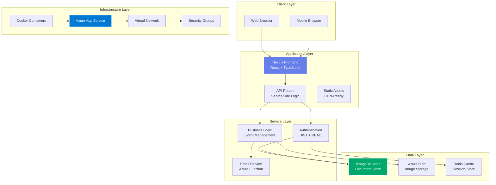
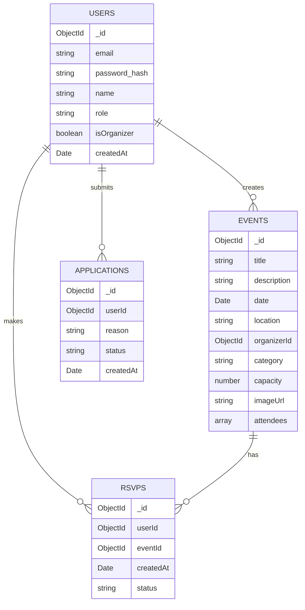
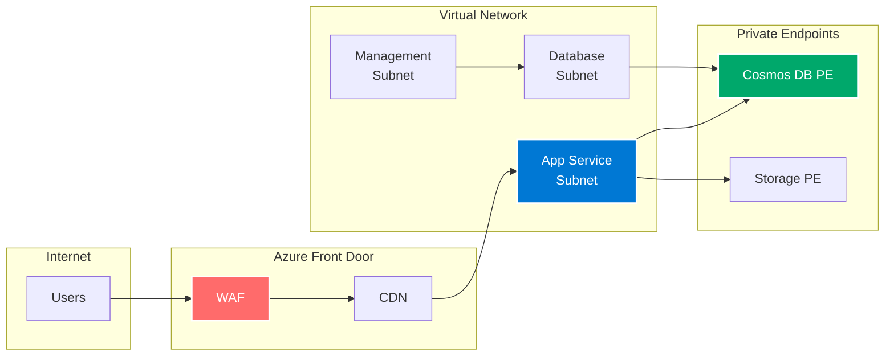
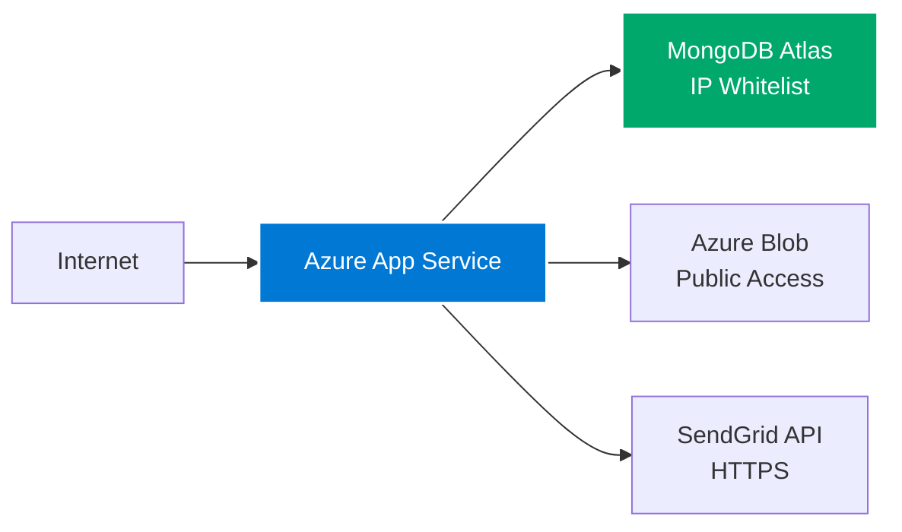
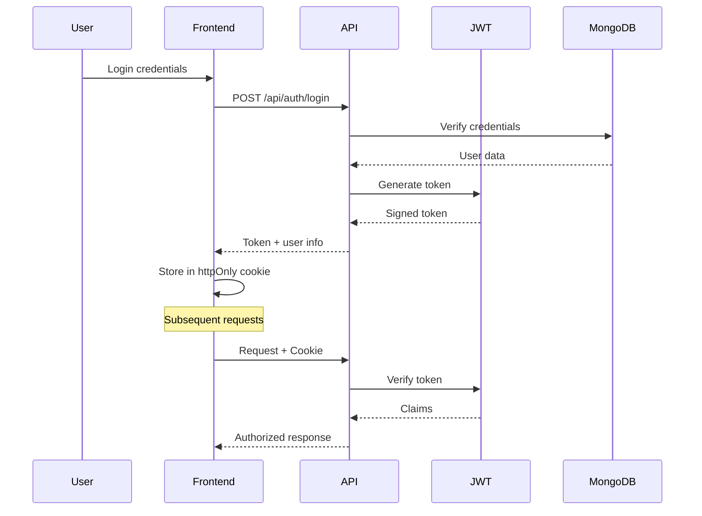
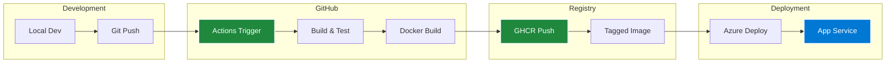

# :material-layers-triple: System Architecture

## Overview

KulturHub implements a modern cloud-native architecture designed for scalability, security, and maintainability. The system follows microservices principles while maintaining cost efficiency for educational purposes.

## High-Level Architecture



## Component Architecture

### Frontend Architecture

The frontend uses Next.js 14 with the App Router for optimal performance and SEO.

**Key Technologies:**<br>
- **Framework:** Next.js 14 (App Router)<br>
- **Language:** TypeScript for type safety<br>
- **Styling:** Tailwind CSS for utility-first design<br>
- **Components:** shadcn/ui for consistent UI<br>
- **State Management:** React Context + Hooks<br>
- **Forms:** React Hook Form + Zod validation

**Directory Structure:**
```
app/
├── (auth)/          # Authentication pages
├── (public)/        # Public routes
├── admin/           # Admin dashboard
├── api/             # API routes
├── events/          # Event pages
└── profile/         # User profiles
```

### Backend Architecture

The backend leverages Next.js API routes with a clear separation of concerns.

**API Structure:**
```
api/
├── auth/            # Authentication endpoints
├── events/          # Event CRUD operations
├── users/           # User management
├── admin/           # Admin operations
└── notifications/   # Email triggers
```

**Key Features:**<br>
- RESTful API design<br>
- JWT-based authentication<br>
- Role-based access control<br>
- Request validation middleware<br>
- Error handling middleware<br>
- Rate limiting

### Database Design

MongoDB Atlas provides flexible document storage with the following collections:



## Network Architecture

### Original Azure-Native Design

The initial implementation used comprehensive Azure networking:



### Optimized Architecture (Current)

Post-optimization, the network design focuses on simplicity:



## Security Architecture

### Authentication Flow



### Security Layers

1. **Application Security**
   - JWT tokens with httpOnly cookies
   - CORS configuration
   - Input validation and sanitization
   - SQL injection prevention (MongoDB)
   - XSS protection headers

2. **Network Security**
   - HTTPS everywhere
   - IP whitelisting for database
   - Azure NSG rules
   - Private endpoints (original design)

3. **Data Security**
   - Passwords hashed with bcrypt
   - Environment variables for secrets
   - No sensitive data in logs
   - Encrypted data at rest

## Deployment Architecture

### Container Strategy

```dockerfile
# Multi-stage build for optimization
FROM node:18-alpine AS deps
WORKDIR /app
COPY package*.json ./
RUN npm ci --only=production

FROM node:18-alpine AS builder
WORKDIR /app
COPY package*.json ./
RUN npm ci
COPY . .
RUN npm run build

FROM node:18-alpine AS runner
WORKDIR /app
ENV NODE_ENV production
COPY --from=builder /app/public ./public
COPY --from=builder /app/.next/standalone ./
COPY --from=builder /app/.next/static ./.next/static

EXPOSE 3000
CMD ["node", "server.js"]
```

### CI/CD Pipeline Architecture



## Scalability Considerations

### Horizontal Scaling

The architecture supports horizontal scaling through:

- **Stateless application design**
- **External session storage**
- **Database connection pooling**
- **CDN for static assets**
- **Load balancer ready**

### Performance Optimizations

1. **Frontend Performance**
   - Next.js automatic code splitting
   - Image optimization with next/image
   - Static generation where possible
   - Client-side caching

2. **Backend Performance**
   - Connection pooling
   - Query optimization
   - Caching strategies
   - Async operations

3. **Database Performance**
   - Indexed queries
   - Aggregation pipelines
   - Connection limits
   - Query monitoring

---

<div class="text-center" markdown>

[:material-arrow-left: Overview](index.md){ .md-button }
[:material-arrow-right: Infrastructure](infrastructure.md){ .md-button .md-button--primary }

</div>