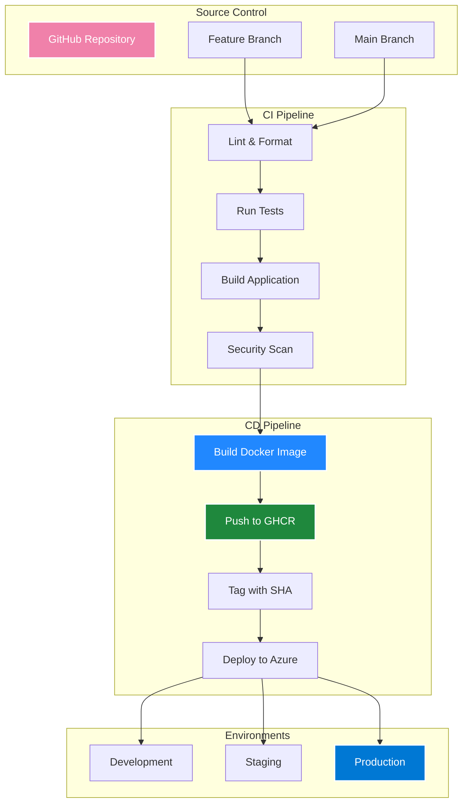
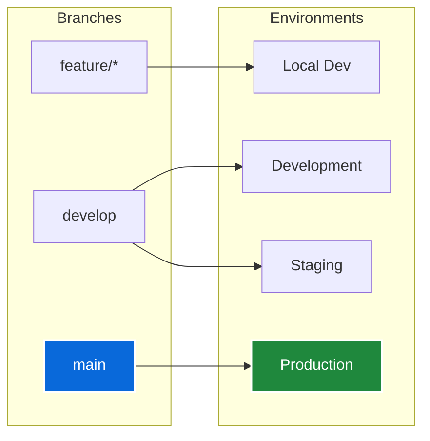

# :material-pipe: CI/CD Pipeline

## Overview

KulturHub implements a comprehensive CI/CD pipeline using GitHub Actions, Docker, and GitHub Container Registry (GHCR). The pipeline automates building, testing, and deployment processes across development and production environments.

## Pipeline Architecture



## GitHub Actions Workflows

### Continuous Integration (CI)

The CI workflow runs on every push and pull request:

```yaml
# .github/workflows/ci.yml
name: CI

on:
  push:
    branches: [main, develop]
  pull_request:
    branches: [main]

jobs:
  lint:
    runs-on: ubuntu-latest
    steps:
      - uses: actions/checkout@v4
      
      - name: Setup Node.js
        uses: actions/setup-node@v4
        with:
          node-version: '18'
          cache: 'npm'
      
      - name: Install dependencies
        run: npm ci
      
      - name: Run ESLint
        run: npm run lint
      
      - name: Check formatting
        run: npm run format:check

  test:
    runs-on: ubuntu-latest
    steps:
      - uses: actions/checkout@v4
      
      - name: Setup Node.js
        uses: actions/setup-node@v4
        with:
          node-version: '18'
          cache: 'npm'
      
      - name: Install dependencies
        run: npm ci
      
      - name: Run unit tests
        run: npm test
      
      - name: Run integration tests
        run: npm run test:integration

  build:
    runs-on: ubuntu-latest
    needs: [lint, test]
    steps:
      - uses: actions/checkout@v4
      
      - name: Setup Node.js
        uses: actions/setup-node@v4
        with:
          node-version: '18'
          cache: 'npm'
      
      - name: Install dependencies
        run: npm ci
      
      - name: Build application
        run: npm run build
      
      - name: Upload build artifacts
        uses: actions/upload-artifact@v3
        with:
          name: build-artifacts
          path: .next/
```

### Continuous Deployment (CD)

The CD workflow handles Docker builds and Azure deployment:

```yaml
# .github/workflows/cd-prod.yml
name: CD Production

on:
  push:
    branches: [main]

env:
  REGISTRY: ghcr.io
  IMAGE_NAME: ${{ github.repository }}

jobs:
  build-and-push:
    runs-on: ubuntu-latest
    permissions:
      contents: read
      packages: write
    
    steps:
      - name: Checkout code
        uses: actions/checkout@v4
      
      - name: Setup Docker Buildx
        uses: docker/setup-buildx-action@v3
      
      - name: Log in to GHCR
        uses: docker/login-action@v3
        with:
          registry: ${{ env.REGISTRY }}
          username: ${{ github.actor }}
          password: ${{ secrets.GITHUB_TOKEN }}
      
      - name: Extract metadata
        id: meta
        uses: docker/metadata-action@v5
        with:
          images: ${{ env.REGISTRY }}/${{ env.IMAGE_NAME }}
          tags: |
            type=ref,event=branch
            type=sha,prefix={{branch}}-
            type=raw,value=latest,enable={{is_default_branch}}
      
      - name: Build and push Docker image
        uses: docker/build-push-action@v5
        with:
          context: .
          push: true
          tags: ${{ steps.meta.outputs.tags }}
          labels: ${{ steps.meta.outputs.labels }}
          cache-from: type=gha
          cache-to: type=gha,mode=max

  deploy:
    needs: build-and-push
    runs-on: ubuntu-latest
    steps:
      - name: Deploy to Azure App Service
        uses: azure/webapps-deploy@v3
        with:
          app-name: kulturhub-app-prod
          publish-profile: ${{ secrets.AZURE_PUBLISH_PROFILE_PROD }}
          images: ghcr.io/${{ github.repository }}:${{ github.sha }}
```

## Docker Configuration

### Multi-Stage Dockerfile

The Dockerfile uses multi-stage builds for optimization:

```dockerfile
# Base dependencies
FROM node:18-alpine AS deps
WORKDIR /app
COPY package*.json ./
RUN npm ci --only=production

# Build stage
FROM node:18-alpine AS builder
WORKDIR /app
COPY package*.json ./
RUN npm ci
COPY . .

# Build arguments for environment variables
ARG NEXT_PUBLIC_API_URL
ARG MONGODB_URI

ENV NEXT_PUBLIC_API_URL=$NEXT_PUBLIC_API_URL
ENV MONGODB_URI=$MONGODB_URI

RUN npm run build

# Production image
FROM node:18-alpine AS runner
WORKDIR /app

ENV NODE_ENV=production
ENV NEXT_TELEMETRY_DISABLED=1

RUN addgroup --system --gid 1001 nodejs
RUN adduser --system --uid 1001 nextjs

COPY --from=builder /app/public ./public
COPY --from=builder /app/.next/standalone ./
COPY --from=builder /app/.next/static ./.next/static

USER nextjs

EXPOSE 3000
ENV PORT 3000

CMD ["node", "server.js"]
```

### Image Optimization

Key optimization strategies:

1. **Multi-stage builds** - Separate build and runtime
2. **Alpine Linux** - Minimal base image
3. **Production dependencies only** - Reduced image size
4. **Non-root user** - Security best practice
5. **Layer caching** - Faster builds

## Deployment Strategy

### Environment Management



### Deployment Process

1. **Code Push** - Developer pushes to branch
2. **CI Checks** - Automated tests and linting
3. **Docker Build** - Container image creation
4. **Registry Push** - Image pushed to GHCR
5. **Azure Deploy** - App Service pulls new image
6. **Health Check** - Verify deployment success

### Rollback Strategy

SHA-based tagging enables quick rollbacks:

```bash
# View available tags
docker images ghcr.io/mvulcu/kulturhub

# Rollback to specific version
az webapp config container set \
  --name kulturhub-app-prod \
  --resource-group kulturhub-rg-prod \
  --docker-custom-image-name ghcr.io/mvulcu/kulturhub:main-abc123
```

## Secrets Management

### GitHub Secrets Configuration

Required secrets for the pipeline:

| Secret Name | Purpose | Scope |
|------------|---------|-------|
| `AZURE_PUBLISH_PROFILE_PROD` | Production deployment | Repository |
| `AZURE_PUBLISH_PROFILE_DEV` | Development deployment | Repository |
| `MONGODB_URI` | Database connection | Repository |
| `SENDGRID_API_KEY` | Email service | Repository |
| `AZURE_STORAGE_CONNECTION_STRING` | Blob storage | Repository |

### Setting Secrets

```bash
# Add secret via GitHub CLI
gh secret set MONGODB_URI --body "mongodb+srv://..."

# Or via GitHub UI
# Settings > Secrets and variables > Actions > New repository secret
```

## Monitoring Deployments

### GitHub Actions Dashboard

Monitor pipeline status:

1. **Actions Tab** - View all workflow runs
2. **Workflow Details** - Step-by-step execution
3. **Logs** - Detailed output for debugging
4. **Artifacts** - Download build outputs

### Azure Deployment Center

Track deployments in Azure:

1. **Deployment History** - All deployments
2. **Logs** - Container startup logs
3. **Metrics** - CPU, memory usage
4. **Diagnostics** - Error troubleshooting

## Best Practices

### 1. Branch Protection

Configure branch protection rules:

```json
{
  "required_status_checks": {
    "strict": true,
    "contexts": ["CI / lint", "CI / test", "CI / build"]
  },
  "enforce_admins": false,
  "required_pull_request_reviews": {
    "required_approving_review_count": 1
  }
}
```

### 2. Dependency Caching

Optimize build times with caching:

```yaml
- name: Cache dependencies
  uses: actions/cache@v3
  with:
    path: ~/.npm
    key: ${{ runner.os }}-node-${{ hashFiles('**/package-lock.json') }}
    restore-keys: |
      ${{ runner.os }}-node-
```

### 3. Security Scanning

Add security checks to the pipeline:

```yaml
- name: Run security audit
  run: npm audit --audit-level=moderate

- name: Scan Docker image
  uses: aquasecurity/trivy-action@master
  with:
    image-ref: ${{ env.REGISTRY }}/${{ env.IMAGE_NAME }}:${{ github.sha }}
```

## Troubleshooting

### Common Issues

1. **Build Failures**
   - Check Node.js version compatibility
   - Verify all environment variables
   - Review build logs for errors

2. **Deployment Failures**
   - Validate publish profile
   - Check Azure service health
   - Verify container registry access

3. **Runtime Errors**
   - Review App Service logs
   - Check environment variables
   - Validate database connectivity

### Debug Commands

```bash
# View GitHub Actions logs
gh run view <run-id> --log

# Check Azure App Service logs
az webapp log tail \
  --name kulturhub-app-prod \
  --resource-group kulturhub-rg-prod

# Test Docker image locally
docker run -p 3000:3000 \
  -e MONGODB_URI="..." \
  ghcr.io/mvulcu/kulturhub:latest
```

---

<div class="text-center" markdown>

[:material-arrow-left: Infrastructure](infrastructure.md){ .md-button }
[:material-arrow-right: Security](security.md){ .md-button .md-button--primary }

</div>