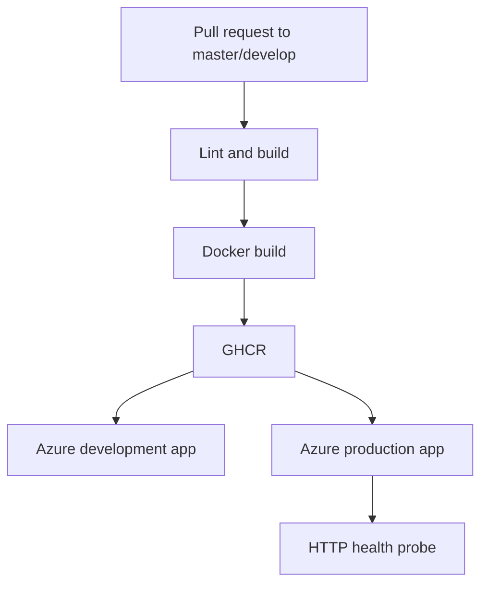

# CI/CD and container delivery

I built KulturHub as a containerized Next.js application. GitHub Actions builds and publishes an image to GHCR; Azure App Service runs that image. The original repository contained two production deployment workflows. In this update I keep a single workflow to avoid competing deployments from the same push.

**Source:** [application workflow](https://github.com/mvulcu/kulturhub_6/blob/codex/kulturhub-core-hardening/.github/workflows/ci-cd.yml) · [Dockerfile](https://github.com/mvulcu/kulturhub_6/blob/codex/kulturhub-core-hardening/Dockerfile) · [Bicep entry point](https://github.com/mvulcu/kulturhub_6/blob/codex/kulturhub-core-hardening/infra/bicep/main.bicep).

## Delivery path


```mermaid
flowchart TB
    PR["Pull request to master/develop"] --> CHECK["Lint and build"]
    CHECK --> IMAGE["Docker build"]
    IMAGE --> GHCR["GHCR"]
    GHCR --> DEV["Azure development app"]
    GHCR --> PROD["Azure production app"]
    PROD --> HEALTH["HTTP health probe"]
```

| Trigger | Build and publish | Deployment |
| --- | --- | --- |
| Pull request to `master` or `develop` | Lint, Next.js build and Docker build; no image push | None |
| Push to `develop` | Same checks; publish `develop` and commit SHA tags | Development App Service |
| Push to `master` | Same checks; publish `master` and commit SHA tags | Production App Service, then `/api/health` check |

This is the **proposed branch workflow**. An image can exist in a repository without proving it is the image currently serving traffic. I check the deployed Azure image setting and the Actions run before making a live-status claim.

## Workflow implementation

The workflow below is copied from the proposed application update. The `npm run build` step uses a build-phase flag and a placeholder URI: the app must never attempt to use that URI at runtime. App Service receives the real database connection string in application settings.

```yaml
name: Build & Deploy to Azure via GHCR

on:
  push:
    branches:
      - master
      - develop
  pull_request:
    branches:
      - master
      - develop

env:
  REGISTRY: ghcr.io
  IMAGE_NAME: ${{ github.repository }}

jobs:
  build-and-test:
    runs-on: ubuntu-latest
    permissions:
      contents: read
      packages: write

    steps:
    - name: Checkout code
      uses: actions/checkout@v4

    - name: Set up Node.js
      uses: actions/setup-node@v4
      with:
        node-version: '18'
        cache: 'npm'

    - name: Install dependencies
      run: npm ci

    - name: Run linting
      run: npm run lint

    - name: Verify production build
      run: NEXT_PHASE=phase-production-build MONGODB_URI=mongodb://placeholder:1234 npm run build

  build-and-push:
    needs: build-and-test
    runs-on: ubuntu-latest
    permissions:
      contents: read
      packages: write

    steps:
    - name: Checkout code
      uses: actions/checkout@v4

    - name: Log in to GitHub Container Registry
      uses: docker/login-action@v3
      with:
        registry: ${{ env.REGISTRY }}
        username: ${{ github.actor }}
        password: ${{ secrets.GITHUB_TOKEN }}

    - name: Extract metadata for Docker
      id: meta
      uses: docker/metadata-action@v5
      with:
        images: ${{ env.REGISTRY }}/${{ env.IMAGE_NAME }}
        tags: |
          type=ref,event=branch
          type=ref,event=pr
          type=semver,pattern={{version}}
          type=semver,pattern={{major}}.{{minor}}
          type=sha,format=short

    - name: Set up Docker Buildx
      uses: docker/setup-buildx-action@v3

    - name: Build and push image to GHCR
      uses: docker/build-push-action@v5
      with:
        context: .
        push: ${{ github.event_name != 'pull_request' }}
        tags: ${{ steps.meta.outputs.tags }}
        labels: ${{ steps.meta.outputs.labels }}
        cache-from: type=gha
        cache-to: type=gha,mode=max

  deploy-dev:
    needs: build-and-push
    if: github.ref == 'refs/heads/develop'
    runs-on: ubuntu-latest
    environment: development

    steps:
    - name: Deploy to Azure Web App (Dev)
      uses: azure/webapps-deploy@v2
      with:
        app-name: kulturhub-app-dev
        publish-profile: ${{ secrets.AZURE_PUBLISH_PROFILE_DEV }}
        images: ${{ env.REGISTRY }}/${{ env.IMAGE_NAME }}:develop

  deploy-prod:
    needs: build-and-push
    if: github.ref == 'refs/heads/master'
    runs-on: ubuntu-latest
    environment: production

    steps:
    - name: Deploy to Azure Web App (Prod)
      uses: azure/webapps-deploy@v2
      with:
        app-name: kulturhub-app-prod
        publish-profile: ${{ secrets.AZURE_PUBLISH_PROFILE_PROD }}
        images: ${{ env.REGISTRY }}/${{ env.IMAGE_NAME }}:master 

    - name: Verify deployed health
      run: curl --fail --retry 6 --retry-delay 10 https://kulturhub-app-prod.azurewebsites.net/api/health
```

The commit SHA tag gives me a stable rollback target, while `master` and `develop` tags are convenient moving pointers. The deployment step currently uses the moving pointer; changing it to the immutable commit tag is a sensible next improvement once the basic release flow is verified.

## Docker build

The multi-stage build installs dependencies and compiles Next.js, then copies the standalone server and static assets into a runtime image. The placeholder MongoDB URI is used for build-time behaviour only. I do not pass the real MongoDB URI to `docker build`.

```dockerfile
# ---- BUILD STAGE ----
FROM node:18-alpine AS builder

WORKDIR /app

RUN apk add --no-cache \
  python3 \
  py3-pip \
  make \
  g++ \
  krb5-dev

COPY package.json package-lock.json ./
RUN npm ci

COPY . .

# Set build phase flag for MongoDB connection handling
ENV NEXT_PHASE=phase-production-build

# Run the build with a placeholder MongoDB URI for build time
RUN MONGODB_URI="mongodb://placeholder:1234" npm run build

# Reset phase flag for runtime
ENV NEXT_PHASE=""

# ---- RUNTIME STAGE ----
FROM node:18-alpine AS runner

WORKDIR /app

ENV NODE_ENV=production

COPY --from=builder /app/.next/standalone ./
COPY --from=builder /app/public ./public
COPY --from=builder /app/.next/static ./.next/static

EXPOSE 3000

CMD ["node", "server.js"]
```

**Next improvement:** run the final image as a dedicated non-root user and update the Node base image after validating native MongoDB packages. The existing Dockerfile does not yet do either, so I do not present them as implemented controls.

## Infrastructure and environments

I use Bicep for the Azure App Service plan, site, storage and network resources. `develop` and `master` map to distinct app names in the workflow. Bicep provisions a B1 plan, where scaling is manual; I do not need a separate paid staging environment for this portfolio project.

Runtime configuration belongs to the App Service settings. GitHub Actions uses publish profiles for deployment; the MongoDB URI and Azure Storage connection string should not be baked into the image or printed as Bicep outputs. The [App Service module](https://github.com/mvulcu/kulturhub_6/blob/codex/kulturhub-core-hardening/infra/bicep/modules/app/appService.bicep) resolves the storage key inside the deployment. Azure recommends keeping secrets out of deployment outputs.

## Post-deployment check and rollback

The workflow checks `/api/health` after production deployment. That route pings MongoDB and responds with HTTP 503 when the dependency is unavailable. A successful probe proves this request completed; it does not establish an uptime percentage.

If a release fails, I identify the last known-good commit tag in GHCR, configure App Service to use that image, then recheck health and a real user flow. Example commands (replace the resource group and tag with the actual release):

```bash
az webapp config container set \
  --resource-group <resource-group> \
  --name kulturhub-app-prod \
  --docker-custom-image-name ghcr.io/mvulcu/kulturhub_6:sha-<short-commit>

curl --fail https://kulturhub-app-prod.azurewebsites.net/api/health
```

Changing the container setting is a **manual rollback procedure**; I would time an actual restore exercise before quoting a recovery time. I would also check image pull permissions for private GHCR packages.

## Secrets and permissions

| Secret or permission | Used by | Handling |
| --- | --- | --- |
| `AZURE_PUBLISH_PROFILE_PROD` / `AZURE_PUBLISH_PROFILE_DEV` | GitHub Actions deployment | GitHub environment or repository secret, scope to the intended app |
| `MONGODB_URI` | Next.js runtime | Azure App Service setting, never a Docker build argument |
| Azure Storage account key | Image upload runtime | Resolved within the deployment; do not export the connection string |
| `AZURE_FUNCTION_KEY` | Notification integration | Runtime setting; rotate if exposed |
| `GITHUB_TOKEN` with package write | GHCR publish | Workflow-scoped token permission |

I keep the production environment protected with a review gate if GitHub plan/settings permit it. No additional cloud platform is required.

## Troubleshooting

| Symptom | First checks |
| --- | --- |
| CI fails before image build | `npm ci`, lint and Next.js build logs; confirm the build-phase flag is set |
| GHCR push fails | `packages: write`, image name, owner and package permissions |
| Azure cannot pull image | App Service registry credentials/permissions and the exact tag in site configuration |
| Container restarts | App Service logs, runtime environment variables, port 3000 and MongoDB connectivity |
| Health check fails | HTTP status, MongoDB ping, application logs; do not mark a 503 response healthy |

```bash
gh run view <run-id> --log
az webapp log tail --resource-group <resource-group> --name kulturhub-app-prod
```

### Next incremental improvements

1. Deploy by immutable SHA tag or digest rather than the moving branch tag.
2. Add focused tests for server-side access control and the registration/login flow, then make them a CI gate. A placeholder `npm test` script would not be evidence of testing.
3. Verify the final image runs as a non-root user and move off an end-of-life Node release with a tested build.
4. Record a rollback exercise and a timestamped release checklist before claiming an RTO or deployment SLO.
