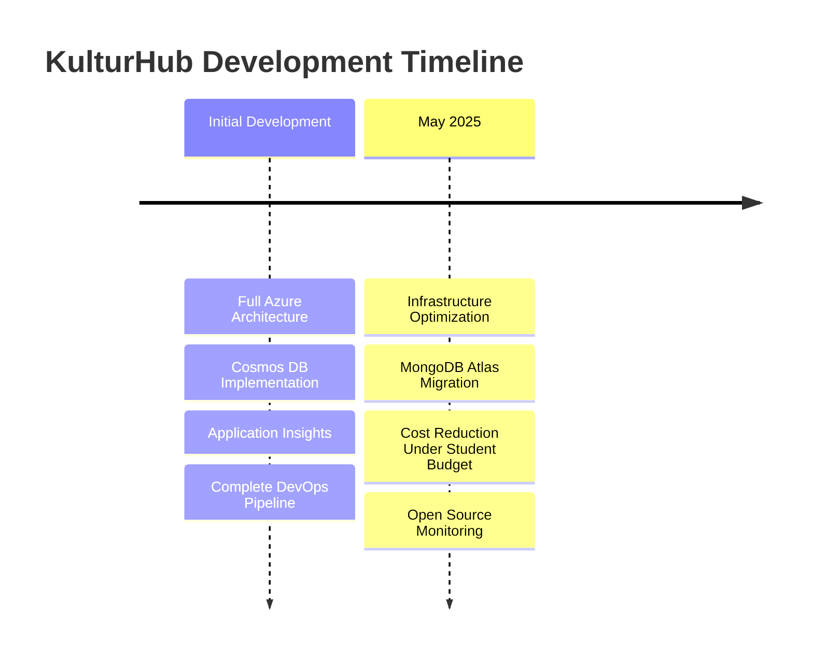

!!! info "My project, reviewed source and limits"
    I describe architecture I implemented, earlier designs and proposed improvements. The linked application repository is `mvulcu/kulturhub_6` at `master` (reviewed 28 September 2026; companion application change: [draft PR #1](https://github.com/mvulcu/kulturhub_6/pull/1)). A source file proves an implementation exists in that branch; it does not certify the currently running Azure configuration.

# :material-calendar-star: KulturHub - Event Management Platform

**An event platform and an engineering case study**  
I built KulturHub to explore application delivery on Azure under a student budget. I kept the earlier Azure architecture in the documentation so the trade-offs behind each change remain visible.

-   :material-web:{ .lg .middle } __Application deployment__

    ---

    The original deployment URL is listed here for historical reference. Check its current availability before using it as evidence of a live service.

    [:octicons-arrow-right-24: Visit Live Site](https://kulturhub-app-prod.azurewebsites.net){ .md-button .md-button--primary }

-   :material-file-document-multiple:{ .lg .middle } __Documentation__

    ---

    Explore detailed technical documentation organized by topic

    [:octicons-book-24: Browse Docs](#documentation){ .md-button }

-   :material-github:{ .lg .middle } __Source Code__

    ---

    Review implementation details and DevOps practices

    [:octicons-mark-github-24: Application source](https://github.com/mvulcu/kulturhub_6){ .md-button }

## :material-rocket-launch: Project Highlights

### What is KulturHub?

KulturHub is a **full-stack cloud-native platform** for managing cultural events, built with a DevOps-first approach. It serves as both a functional application and a comprehensive demonstration of modern infrastructure practices.

:material-account-multiple:{ .lg } **Multi-Role System**
: Users, Organizers, Administrators

:material-calendar-check:{ .lg } **Event Management**
: Create, discover, and RSVP to events

:material-email-fast:{ .lg } **Notifications**
: Automated email confirmations

:material-image-multiple:{ .lg } **Media Storage**
: Image uploads with CDN support

:material-shield-account:{ .lg } **Secure Access**
: Server-side sessions and API role checks

:material-chart-line:{ .lg } **Real Monitoring**
: Live metrics and dashboards

## :material-timeline: Project Evolution

```mermaid
timeline
    title KulturHub Development Timeline
    
    Initial Development : Full Azure Architecture
                       : Cosmos DB Implementation
                       : Application Insights
                       : Complete DevOps Pipeline
    
    May 2025          : Infrastructure Optimization
                      : MongoDB Atlas Migration
                      : Cost Reduction Under Student Budget
                      : Open Source Monitoring
```

## :material-stack-overflow: Technical Stack

-   :material-application:{ .lg .middle } __Frontend__

    ---
    
    - **Framework:** Next.js 15 (reviewed source)
    - **Styling:** Tailwind CSS
    - **Components:** shadcn/ui
    - **Type Safety:** TypeScript

-   :material-server:{ .lg .middle } __Backend__

    ---
    
    - **API:** Next.js API Routes
    - **Database:** MongoDB Atlas
    - **Storage:** Azure Blob
    - **Functions:** Azure Functions

-   :material-infinity:{ .lg .middle } __DevOps__

    ---
    
    - **IaC:** Azure Bicep
    - **CI/CD:** GitHub Actions
    - **Containers:** Docker + GHCR
    - **Monitoring:** Grafana Stack

## :material-book-open-variant: Documentation { #documentation }

### Architecture & Design

-   :material-layers-triple:{ .lg } __[System Architecture](architecture.md)__
    
    Complete architectural overview with diagrams

-   :material-terraform:{ .lg } __[Infrastructure as Code](infrastructure.md)__
    
    Bicep templates and deployment strategies

-   :material-network:{ .lg } __[Network & Security](security.md)__
    
    Authentication, API authorization and network history

### Implementation & Operations

-   :material-docker:{ .lg } __[Containerization & CI/CD](cicd.md)__
    
    Docker strategy and GitHub Actions pipelines

-   :material-monitor-dashboard:{ .lg } __[Monitoring & Observability](monitoring.md)__
    
    Metrics, alerts, and dashboards

-   :material-function:{ .lg } __[Microservices](microservices.md)__
    
    Email notifications and event-driven architecture

### Optimization & Learning

-   :material-currency-usd:{ .lg } __[Cost Optimization](optimization.md)__
    
    May 2025 migration and cost model

-   :material-school:{ .lg } __[Learning Outcomes](learning.md)__
    
    Skills gained and challenges overcome

## :material-star-outline: Key Achievements

!!! success "Project Accomplishments"

    

    
    :material-percent:{ .lg } **~86–89%**
    : Modelled reduction using the historical estimates in the cost chapter; not verified against invoices
    
    :material-timer:{ .lg } **Rollback**
    : Image rollback procedure documented; restore time requires a timed exercise
    
    :material-package-variant:{ .lg } **Multi-stage**
    : Container build; image size depends on the built artifact
    
    :material-file-code:{ .lg } **Bicep**
    : Azure resources described as code; external MongoDB Atlas managed separately
    
    

## :material-presentation: Live Demo Features

Visit the [live platform](https://kulturhub-app-prod.azurewebsites.net) to explore:

- **Public Access:** Browse cultural events without registration
- **User Registration:** Create account and RSVP to events
- **Organizer Portal:** Apply for organizer status and create events
- **Admin Panel:** Manage users and moderate content (restricted access)

## :material-navigation: Quick Navigation

-   :material-fast-forward:{ .lg .middle } __Getting Started__

    ---
    
    1. [Architecture Overview](architecture.md)
    2. [Infrastructure Setup](infrastructure.md)
    3. [Deployment Guide](cicd.md)

-   :material-trending-up:{ .lg .middle } __Advanced Topics__

    ---
    
    1. [Security Deep Dive](security.md)
    2. [Monitoring Strategy](monitoring.md)
    3. [Cost Optimization](optimization.md)

---

**KulturHub** - Where DevOps meets Event Management

[:material-arrow-left: Back to Library](../index.md){ .md-button }
[:material-arrow-right: Architecture](architecture.md){ .md-button .md-button--primary }

