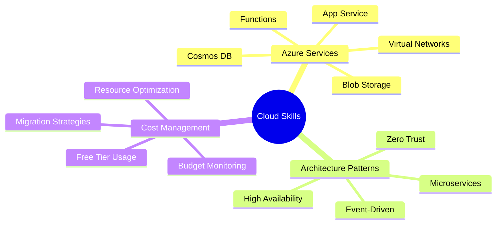
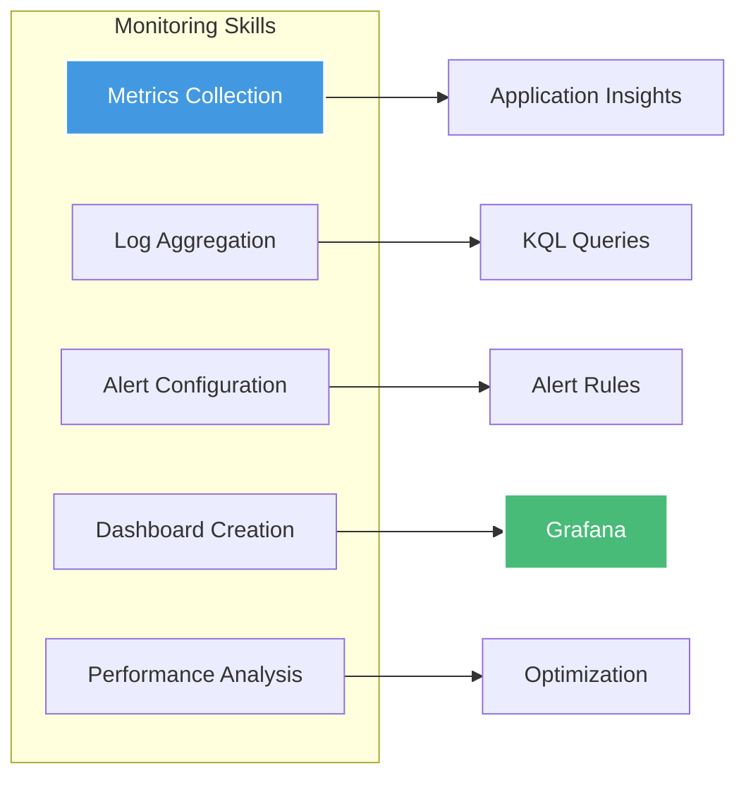
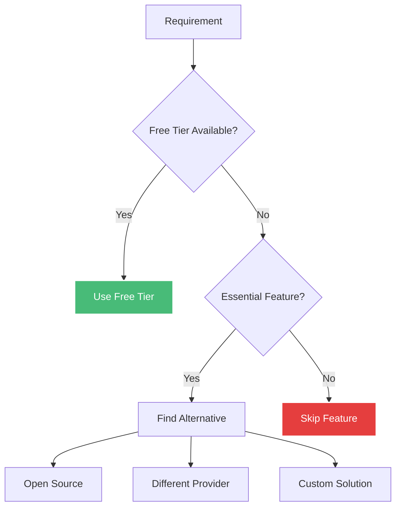
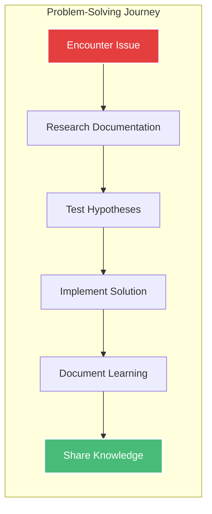
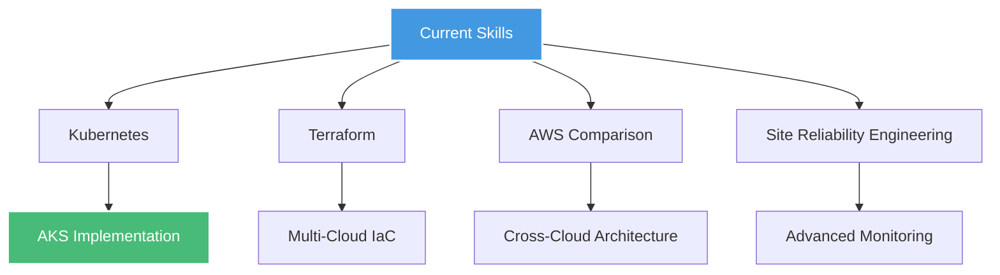

# :material-school: Learning Outcomes

## Overview

The KulturHub project served as a comprehensive DevOps learning experience, bridging the gap between theoretical knowledge and practical implementation. This document reflects on the technical skills acquired, challenges overcome, and professional growth achieved.

## Technical Skills Acquired

### Cloud Architecture



#### Key Competencies Developed

1. **Resource Provisioning**
   - Creating and configuring Azure resources
   - Understanding service limitations
   - Working with Azure CLI
   - Resource group management

2. **Network Design**
   - VNet configuration
   - Subnet architecture
   - Private endpoints
   - Network security groups

3. **Security Implementation**
   - Identity and access management
   - Secret management
   - Network isolation
   - Data encryption

### Infrastructure as Code

#### Bicep Expertise

```bicep
// Learned to write modular, reusable templates
module appService 'modules/appservice.bicep' = {
  name: 'appServiceDeployment'
  params: {
    environment: environment
    location: location
    planId: appServicePlan.outputs.planId
  }
}
```

**Skills Gained:**<br>
- Declarative infrastructure definition<br>
- Module composition<br>
- Parameter management<br>
- Output handling<br>
- Dependency management<br>
- What-if analysis

### Containerization & CI/CD

#### Docker Proficiency

```dockerfile
# Learned multi-stage builds for optimization
FROM node:18-alpine AS deps
FROM node:18-alpine AS builder
FROM node:18-alpine AS runner
```

**Achievements:**<br>
- Multi-stage build optimization<br>
- Image size reduction (from 1GB to 150MB)<br>
- Security best practices<br>
- Layer caching strategies

#### GitHub Actions Mastery

```yaml
# Learned to create complex workflows
- Build and test automation
- Container registry integration
- Deployment orchestration
- Secret management
- Environment-specific deployments
```

### Monitoring & Observability



## Challenges Overcome

### Technical Challenges

#### 1. Azure Student Limitations

**Challenge:** <br>
- No access to enterprise features<br>
- No Azure Container Registry<br>
- No Key Vault<br>
- No custom RBAC<br>
- Limited public IPs

**Solution Learned:**<br>
- Use GitHub Container Registry<br>
- GitHub Secrets + App Settings<br>
- Publish profiles for deployment<br>
- Temporary VMs with cleanup

#### 2. Network Connectivity Issues

**Challenge:** <br>
App Service couldn't reach Cosmos DB through Private Endpoint

**Debugging Process:**<br>
1. Verified VNet integration<br>
2. Checked DNS resolution<br>
3. Tested from Jumpbox VM<br>
4. Fixed subnet delegation<br>
5. Configured service endpoints

**Lesson Learned:** <br>
Network troubleshooting requires systematic approach and understanding of Azure networking model.

#### 3. Container Build Failures

**Challenge:** <br>
Next.js standalone build issues with Docker

**Issues Encountered:**<br>
- Missing dependencies in production<br>
- Large image sizes<br>
- Runtime errors<br>
- Environment variable handling

**Solutions Discovered:**<br>
- Use standalone output mode<br>
- Implement multi-stage builds<br>
- Properly handle build-time vs runtime variables<br>
- Copy all necessary static files

#### 4. Cost Overruns

**Challenge:** <br>
Initial architecture exceeded $100/year student credit

**Problem Analysis:**<br>
- Cosmos DB consumption<br>
- Application Insights ingestion<br>
- Multiple public IPs<br>
- Unused resources

**Resolution:**<br>
- Migrated to MongoDB Atlas<br>
- Removed Application Insights<br>
- Implemented resource cleanup<br>
- Regular cost monitoring

### Operational Challenges

#### 1. Monitoring Without Premium Tools

**Challenge:** <br>
No access to full Azure Monitor suite

**Creative Solutions:**<br>
- Built custom Grafana stack on VM<br>
- Implemented structured logging<br>
- Created manual alerts<br>
- Used free tier alternatives

#### 2. Deployment Complexity

**Challenge:** <br>
No Service Principal for automated deployments

**Workaround Implementation:**<br>
- Publish profiles in GitHub Secrets<br>
- Manual credential management<br>
- Alternative authentication methods<br>
- Simplified deployment scripts

## Key Learning Moments

### 1. The Power of Simplicity

> "Perfect is the enemy of good" - Voltaire

**Initial Approach:**<br>
- Over-engineered with every Azure service<br>
- Complex network architecture<br>
- Premium features everywhere

**Learned Approach:**<br>
- Start with minimal viable architecture<br>
- Add complexity only when needed<br>
- Focus on core functionality first

### 2. Cost-Conscious Architecture



### 3. Documentation is Code

**Realization:** <br>
Good documentation is as important as good code

**Implemented Practices:**<br>
- Inline code comments<br>
- README files for each component<br>
- Architecture decision records<br>
- Runbook documentation<br>
- Learning log maintenance

## Professional Growth

### DevOps Mindset Development

#### Before Project<br>
- Developer-focused thinking<br>
- Manual processes acceptable<br>
- Limited cloud knowledge<br>
- Basic Git usage

#### After Project<br>
- Infrastructure as Code advocate<br>
- Automation-first approach<br>
- Cloud architecture understanding<br>
- Advanced CI/CD implementation

### Problem-Solving Evolution



**Key Improvements:**<br>
1. Systematic debugging approach<br>
2. Root cause analysis<br>
3. Documentation habits<br>
4. Knowledge sharing mindset

## Practical Skills for Industry

### 1. Real-World Constraints

**Learned to work with:**<br>
- Budget limitations<br>
- Service restrictions<br>
- Time constraints<br>
- Technical debt<br>
- Legacy considerations

### 2. Communication Skills

**Improved abilities:**<br>
- Technical documentation writing<br>
- Architecture diagram creation<br>
- Decision justification<br>
- Stakeholder communication<br>
- Incident reporting

### 3. Best Practices Adoption

**Implemented standards:**<br>
- Git flow branching<br>
- Semantic versioning<br>
- Code review processes<br>
- Security-first design<br>
- Performance optimization

## Tools Mastery

### Development Tools

| Tool | Proficiency | Key Skills |
|------|-------------|------------|
| **VS Code** | Expert | Extensions, debugging, remote dev |
| **Azure CLI** | Advanced | Resource management, scripting |
| **Docker** | Advanced | Multi-stage builds, optimization |
| **Git** | Advanced | Branching, rebasing, workflows |
| **Postman** | Intermediate | API testing, collections |

### Cloud Services

| Service | Experience | Use Cases |
|---------|------------|-----------|
| **App Service** | Expert | Container hosting, configuration |
| **MongoDB Atlas** | Advanced | Migration, optimization |
| **GitHub Actions** | Expert | Complex workflows, secrets |
| **Grafana** | Intermediate | Dashboards, queries |
| **Azure Functions** | Advanced | Event-driven architecture |

## Mistakes and Lessons

### What I Would Do Differently

1. **Start Simple**
   - Begin with basic architecture
   - Iterate based on real needs
   - Avoid premature optimization

2. **Cost Planning First**
   - Estimate costs before implementation
   - Set up budget alerts immediately
   - Regular cost reviews

3. **Testing Strategy**
   - Implement tests from day one
   - Include integration tests
   - Performance testing early

4. **Documentation Driven Development**
   - Write docs before code
   - Keep architecture decisions log
   - Update docs with code changes

### Valuable Failures

1. **Cosmos DB Private Endpoint Issues**
   - Learned Azure networking deeply
   - Understood DNS resolution
   - Gained troubleshooting skills

2. **Application Insights Costs**
   - Learned about ingestion pricing
   - Understood telemetry optimization
   - Found alternative solutions

3. **Complex Architecture Overhead**
   - Learned simplicity value
   - Understood maintenance burden
   - Gained refactoring experience

## Career Impact

### Portfolio Value

The KulturHub project demonstrates:

- ✅ Full-stack development skills
- ✅ Cloud architecture expertise
- ✅ DevOps practices implementation
- ✅ Problem-solving abilities
- ✅ Cost optimization skills
- ✅ Documentation excellence

### Interview Preparation

**Can confidently discuss:**<br>
- Architecture decisions and trade-offs<br>
- CI/CD pipeline implementation<br>
- Security best practices<br>
- Monitoring strategies<br>
- Cost optimization techniques<br>
- Troubleshooting experiences

## Future Learning Path

### Next Steps



### Planned Improvements

1. **Add Kubernetes deployment option**
2. **Implement Terraform alongside Bicep**
3. **Create AWS implementation guide**
4. **Add comprehensive testing suite**
5. **Implement GitOps workflow**

## Conclusion

The KulturHub project transformed theoretical DevOps knowledge into practical, industry-relevant skills. Working within the constraints of Azure Student subscription taught valuable lessons about resource optimization, creative problem-solving, and architectural simplicity.

**Key Takeaways:**<br>
- Constraints drive innovation<br>
- Simplicity beats complexity<br>
- Documentation is crucial<br>
- Continuous learning is essential<br>
- Real projects teach best

This project stands as proof that professional-grade DevOps practices can be learned and implemented even with limited resources, preparing for real-world challenges in the industry.

---

<div class="text-center" markdown>

**Thank you for exploring the KulturHub journey!**

[:material-arrow-left: Cost Optimization](optimization.md){ .md-button }
[:material-arrow-up: Back to Overview](index.md){ .md-button .md-button--primary }

</div>