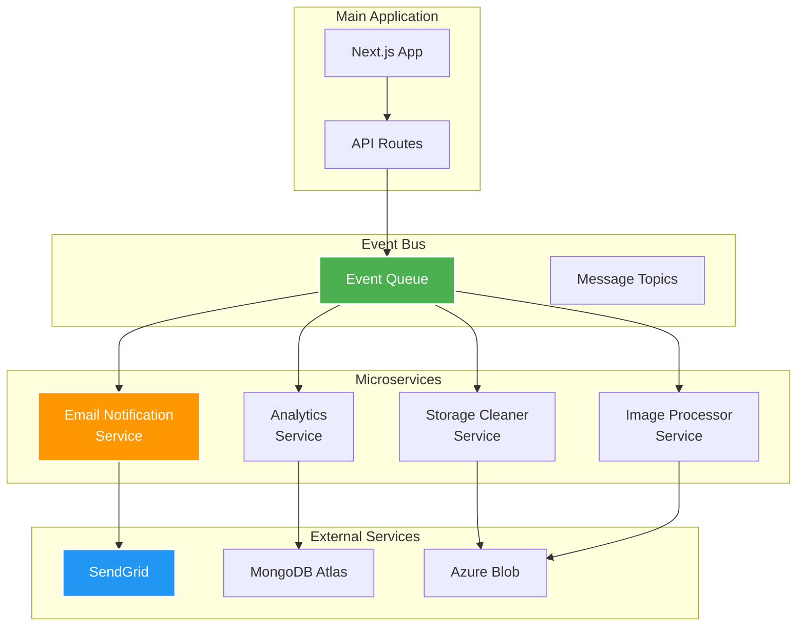
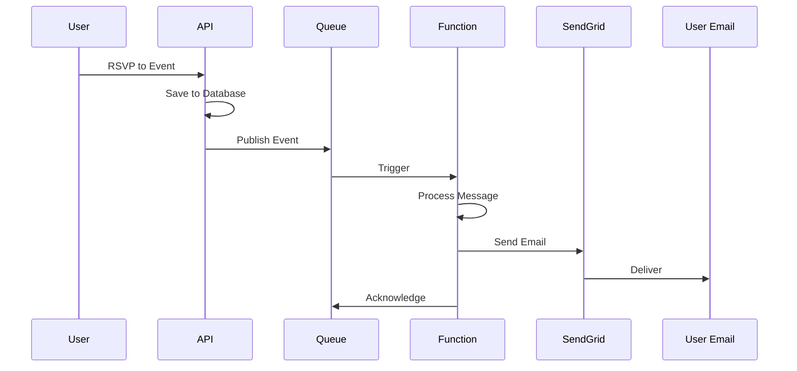
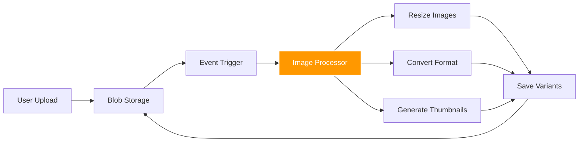
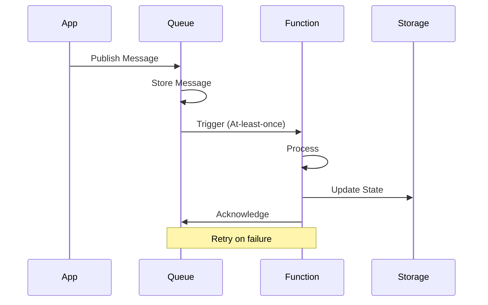

# :material-function-variant: Microservices Architecture

## Overview

KulturHub implements a microservices approach using Azure Functions for specific business capabilities. This architecture provides scalability, independent deployment, and clear separation of concerns while maintaining cost efficiency.

## Microservices Design



## Email Notification Service

### Architecture

The email notification service is implemented as an isolated Azure Function:



### Implementation

```typescript
// functions/emailNotification/index.ts
import { AzureFunction, Context, HttpRequest } from "@azure/functions";
import * as sgMail from '@sendgrid/mail';

interface EmailPayload {
  to: string;
  eventName: string;
  eventDate: string;
  userName: string;
  action: 'rsvp' | 'create' | 'update' | 'cancel';
}

const emailFunction: AzureFunction = async function (
  context: Context, 
  req: HttpRequest
): Promise<void> {
  context.log('Email notification function triggered');
  
  try {
    const payload: EmailPayload = req.body;
    
    // Validate payload
    if (!payload.to || !payload.eventName) {
      context.res = {
        status: 400,
        body: "Missing required fields"
      };
      return;
    }
    
    // Initialize SendGrid
    sgMail.setApiKey(process.env.SENDGRID_API_KEY);
    
    // Build email template
    const msg = {
      to: payload.to,
      from: 'noreply@kulturhub.app',
      subject: getEmailSubject(payload),
      html: getEmailTemplate(payload),
      trackingSettings: {
        clickTracking: { enable: true },
        openTracking: { enable: true }
      }
    };
    
    // Send email
    await sgMail.send(msg);
    
    context.log(`Email sent successfully to ${payload.to}`);
    context.res = {
      status: 200,
      body: { success: true, message: "Email sent" }
    };
    
  } catch (error) {
    context.log.error('Email sending failed:', error);
    context.res = {
      status: 500,
      body: { success: false, error: error.message }
    };
  }
};

function getEmailSubject(payload: EmailPayload): string {
  const subjects = {
    rsvp: `Confirmation: You're registered for ${payload.eventName}`,
    create: `Event created: ${payload.eventName}`,
    update: `Event updated: ${payload.eventName}`,
    cancel: `Event cancelled: ${payload.eventName}`
  };
  return subjects[payload.action];
}

function getEmailTemplate(payload: EmailPayload): string {
  return `
    <!DOCTYPE html>
    <html>
    <head>
      <style>
        body { font-family: Arial, sans-serif; }
        .container { max-width: 600px; margin: 0 auto; }
        .header { background: #5e72e4; color: white; padding: 20px; }
        .content { padding: 20px; }
        .footer { background: #f8f9fa; padding: 20px; }
      </style>
    </head>
    <body>
      <div class="container">
        <div class="header">
          <h1>KulturHub</h1>
        </div>
        <div class="content">
          <h2>Hi ${payload.userName},</h2>
          <p>${getEmailMessage(payload)}</p>
          <p><strong>Event:</strong> ${payload.eventName}</p>
          <p><strong>Date:</strong> ${payload.eventDate}</p>
        </div>
        <div class="footer">
          <p>Thank you for using KulturHub!</p>
        </div>
      </div>
    </body>
    </html>
  `;
}

export default emailFunction;
```
### Configuration

Azure Function settings:

| Setting | Value | Description |
|---------|-------|-------------|
| **Runtime** | Node.js 18 | JavaScript runtime |
| **Trigger** | HTTP | REST endpoint |
| **Plan** | Consumption | Pay per execution |
| **Timeout** | 60 seconds | Max execution time |
| **Memory** | 128 MB | Memory allocation |

Environment variables:

```json
{
  "SENDGRID_API_KEY": "SG.xxx",
  "EMAIL_FROM": "noreply@kulturhub.app",
  "EMAIL_DOMAIN": "kulturhub.app"
}
```

### Integration with Main App

```typescript
// app/api/events/[id]/rsvp/route.ts
import { notifyUser } from '@/services/notifications';

export async function POST(req: Request) {
  // ... RSVP logic ...
  
  // Send notification
  await notifyUser({
    to: user.email,
    eventName: event.title,
    eventDate: event.date,
    userName: user.name,
    action: 'rsvp'
  });
  
  return Response.json({ success: true });
}

// services/notifications.ts
export async function notifyUser(payload: EmailPayload) {
  const functionUrl = process.env.AZURE_FUNCTION_URL;
  const functionKey = process.env.AZURE_FUNCTION_KEY;
  
  try {
    const response = await fetch(`${functionUrl}/api/emailNotification`, {
      method: 'POST',
      headers: {
        'Content-Type': 'application/json',
        'x-functions-key': functionKey
      },
      body: JSON.stringify(payload)
    });
    
    if (!response.ok) {
      throw new Error('Notification failed');
    }
    
    return await response.json();
  } catch (error) {
    console.error('Failed to send notification:', error);
    // Don't fail the main operation
  }
}
```

## Storage Cleaner Service

### Purpose

Automatically clean up unused images and temporary files to optimize storage costs.

### Implementation

```typescript
// functions/storageCleaner/index.ts
import { AzureFunction, Context } from "@azure/functions";
import { BlobServiceClient } from "@azure/storage-blob";
import { connectToDatabase } from "../shared/database";

const storageCleanerFunction: AzureFunction = async function (
  context: Context
): Promise<void> {
  context.log('Storage cleaner function started');
  
  try {
    // Connect to database
    const db = await connectToDatabase();
    
    // Get all active image URLs from database
    const activeImages = await db.collection('events')
      .find({}, { projection: { imageUrl: 1 } })
      .toArray();
    
    const activeUrls = new Set(
      activeImages
        .map(e => e.imageUrl)
        .filter(Boolean)
        .map(url => new URL(url).pathname.split('/').pop())
    );
    
    // Connect to blob storage
    const blobServiceClient = BlobServiceClient.fromConnectionString(
      process.env.AZURE_STORAGE_CONNECTION_STRING
    );
    
    const containerClient = blobServiceClient.getContainerClient('images');
    
    let deletedCount = 0;
    const thirtyDaysAgo = new Date();
    thirtyDaysAgo.setDate(thirtyDaysAgo.getDate() - 30);
    
    // List all blobs
    for await (const blob of containerClient.listBlobsFlat()) {
      // Skip if blob is in use
      if (activeUrls.has(blob.name)) {
        continue;
      }
      
      // Skip if blob is recent
      if (blob.properties.lastModified > thirtyDaysAgo) {
        continue;
      }
      
      // Delete unused old blob
      await containerClient.deleteBlob(blob.name);
      deletedCount++;
      context.log(`Deleted unused blob: ${blob.name}`);
    }
    
    context.log(`Storage cleanup completed. Deleted ${deletedCount} blobs.`);
    
  } catch (error) {
    context.log.error('Storage cleanup failed:', error);
    throw error;
  }
};

export default storageCleanerFunction;
```

### Schedule Configuration

```json
{
  "schedule": "0 0 2 * * *",
  "description": "Run daily at 2 AM"
}
```

## Image Processor Service

### Purpose

Optimize uploaded images for web delivery.

### Architecture



### Implementation

```typescript
// functions/imageProcessor/index.ts
import { AzureFunction, Context } from "@azure/functions";
import sharp from 'sharp';
import { BlobServiceClient } from "@azure/storage-blob";

interface ImageVariant {
  suffix: string;
  width: number;
  height?: number;
  format: 'jpeg' | 'webp';
  quality: number;
}

const variants: ImageVariant[] = [
  { suffix: '-thumb', width: 150, height: 150, format: 'jpeg', quality: 80 },
  { suffix: '-small', width: 400, format: 'jpeg', quality: 85 },
  { suffix: '-medium', width: 800, format: 'jpeg', quality: 85 },
  { suffix: '-large', width: 1200, format: 'jpeg', quality: 90 },
  { suffix: '-webp', width: 800, format: 'webp', quality: 85 }
];

const imageProcessorFunction: AzureFunction = async function (
  context: Context,
  inputBlob: Buffer
): Promise<void> {
  context.log('Image processor triggered for:', context.bindingData.name);
  
  try {
    const blobServiceClient = BlobServiceClient.fromConnectionString(
      process.env.AZURE_STORAGE_CONNECTION_STRING
    );
    
    const containerClient = blobServiceClient.getContainerClient('images');
    const originalName = context.bindingData.name;
    const nameWithoutExt = originalName.split('.')[0];
    
    // Process each variant
    for (const variant of variants) {
      const processed = await sharp(inputBlob)
        .resize(variant.width, variant.height, {
          fit: variant.height ? 'cover' : 'inside',
          withoutEnlargement: true
        })
        .toFormat(variant.format, { quality: variant.quality })
        .toBuffer();
      
      const variantName = `${nameWithoutExt}${variant.suffix}.${variant.format}`;
      const blockBlobClient = containerClient.getBlockBlobClient(variantName);
      
      await blockBlobClient.upload(processed, processed.length, {
        blobHTTPHeaders: {
          blobContentType: `image/${variant.format}`
        }
      });
      
      context.log(`Created variant: ${variantName}`);
    }
    
  } catch (error) {
    context.log.error('Image processing failed:', error);
    throw error;
  }
};

export default imageProcessorFunction;
```

## Event-Driven Communication

### Message Queue Pattern



### Event Types

```typescript
// types/events.ts
export interface DomainEvent {
  id: string;
  type: string;
  timestamp: Date;
  payload: any;
  metadata: {
    userId?: string;
    correlationId: string;
    source: string;
  };
}

export type EventType = 
  | 'user.registered'
  | 'user.updated'
  | 'event.created'
  | 'event.updated'
  | 'event.cancelled'
  | 'rsvp.created'
  | 'rsvp.cancelled'
  | 'organizer.approved';
```

## Monitoring Microservices

### Function Metrics

Key metrics tracked:

| Metric | Description | Target |
|--------|-------------|--------|
| Execution Count | Invocations per minute | - |
| Success Rate | Successful executions | > 99% |
| Average Duration | Processing time | < 1s |
| Error Count | Failed executions | < 1% |

### Distributed Tracing

```typescript
// Correlation ID tracking
export function createCorrelationId(): string {
  return `${Date.now()}-${Math.random().toString(36).substr(2, 9)}`;
}

export function trackEvent(
  context: Context,
  event: string,
  properties: Record<string, any>
) {
  context.log({
    event,
    correlationId: context.bindingData.correlationId,
    timestamp: new Date().toISOString(),
    ...properties
  });
}
```

## Best Practices

### 1. Idempotency

Ensure operations can be safely retried:

```typescript
// Use unique operation IDs
async function processMessage(message: any) {
  const operationId = message.id;
  
  // Check if already processed
  const existing = await db.collection('operations')
    .findOne({ operationId });
  
  if (existing) {
    console.log('Message already processed');
    return;
  }
  
  // Process message
  await handleMessage(message);
  
  // Mark as processed
  await db.collection('operations')
    .insertOne({ operationId, processedAt: new Date() });
}
```

### 2. Error Handling

Implement robust error handling:

```typescript
export async function withRetry<T>(
  operation: () => Promise<T>,
  maxRetries: number = 3
): Promise<T> {
  let lastError: Error;
  
  for (let i = 0; i < maxRetries; i++) {
    try {
      return await operation();
    } catch (error) {
      lastError = error;
      
      // Exponential backoff
      const delay = Math.pow(2, i) * 1000;
      await new Promise(resolve => setTimeout(resolve, delay));
    }
  }
  
  throw lastError;
}
```

### 3. Circuit Breaker

Prevent cascade failures:

```typescript
class CircuitBreaker {
  private failures = 0;
  private lastFailureTime: Date;
  private state: 'CLOSED' | 'OPEN' | 'HALF_OPEN' = 'CLOSED';
  
  constructor(
    private threshold: number = 5,
    private timeout: number = 60000
  ) {}
  
  async execute<T>(operation: () => Promise<T>): Promise<T> {
    if (this.state === 'OPEN') {
      if (Date.now() - this.lastFailureTime.getTime() > this.timeout) {
        this.state = 'HALF_OPEN';
      } else {
        throw new Error('Circuit breaker is OPEN');
      }
    }
    
    try {
      const result = await operation();
      this.onSuccess();
      return result;
    } catch (error) {
      this.onFailure();
      throw error;
    }
  }
  
  private onSuccess() {
    this.failures = 0;
    this.state = 'CLOSED';
  }
  
  private onFailure() {
    this.failures++;
    this.lastFailureTime = new Date();
    
    if (this.failures >= this.threshold) {
      this.state = 'OPEN';
    }
  }
}
```

## Cost Analysis

### Function Costs

| Service | Executions/month | Cost |
|---------|-----------------|------|
| Email Notifications | 10,000 | Free tier |
| Storage Cleaner | 30 | Free tier |
| Image Processor | 1,000 | Free tier |

Azure Functions free tier includes:
- 1 million executions/month
- 400,000 GB-s compute time

---

<div class="text-center" markdown>

[:material-arrow-left: Monitoring](monitoring.md){ .md-button }
[:material-arrow-right: Cost Optimization](optimization.md){ .md-button .md-button--primary }

</div>