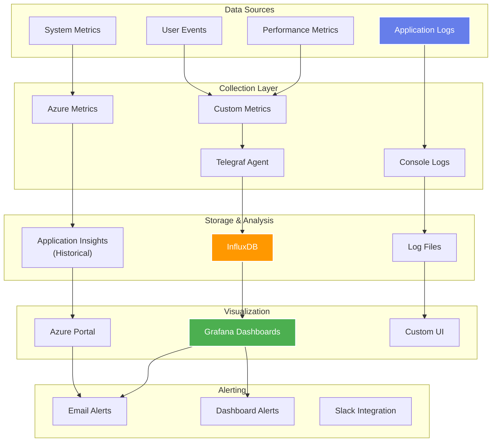
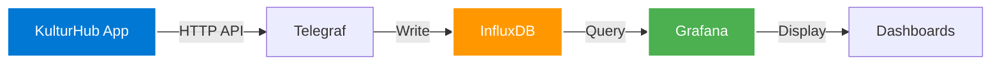
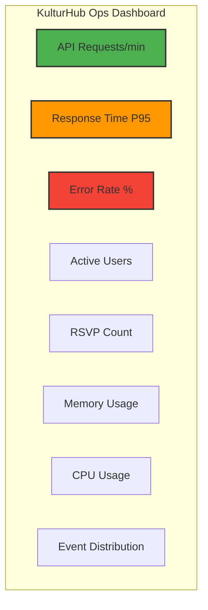

# :material-monitor-dashboard: Monitoring & Observability

## Overview

KulturHub implements a multi-layered monitoring strategy combining Azure-native tools with open-source solutions. This approach provides comprehensive visibility into application health, performance, and user behavior while maintaining cost efficiency.

## Monitoring Architecture



## Application Insights (Historical)

### Original Implementation

Before optimization, Application Insights provided:

```typescript
// lib/insights.ts (removed in optimization)
import { ApplicationInsights } from '@applicationinsights/web';

const appInsights = new ApplicationInsights({
  config: {
    connectionString: process.env.APPLICATIONINSIGHTS_CONNECTION_STRING,
    enableAutoRouteTracking: true,
    enableRequestHeaderTracking: true,
    enableResponseHeaderTracking: true,
  }
});

appInsights.loadAppInsights();
appInsights.trackPageView();
```

### Metrics Collected

- **Performance Metrics**
  - Page load times
  - API response times
  - Dependency durations
  - Resource usage

- **Usage Analytics**
  - Page views
  - User sessions
  - Browser statistics
  - Geographic distribution

- **Error Tracking**
  - Exceptions
  - Failed requests
  - Console errors
  - Stack traces

## Current Monitoring Stack

### 1. Application Logging

Post-optimization logging strategy:

```typescript
// utils/logger.ts
const isDevelopment = process.env.NODE_ENV === 'development';

export const logger = {
  info: (message: string, data?: any) => {
    if (isDevelopment) {
      console.log(`[INFO] ${new Date().toISOString()} - ${message}`, data);
    }
  },
  
  error: (message: string, error?: any) => {
    console.error(`[ERROR] ${new Date().toISOString()} - ${message}`, error);
    // Send to monitoring in production
    if (!isDevelopment && globalThis.telegraf) {
      globalThis.telegraf.sendMetric('app.error', 1, { message });
    }
  },
  
  metric: (name: string, value: number, tags?: Record<string, string>) => {
    if (!isDevelopment && globalThis.telegraf) {
      globalThis.telegraf.sendMetric(name, value, tags);
    }
  }
};
```

### 2. Grafana + InfluxDB + Telegraf

The custom monitoring stack on Azure VM:



#### Telegraf Configuration

```toml
# /etc/telegraf/telegraf.conf
[agent]
  interval = "10s"
  flush_interval = "10s"

[[inputs.http_listener_v2]]
  service_address = ":8080"
  path = "/telegraf"
  data_format = "json"

[[outputs.influxdb_v2]]
  urls = ["http://localhost:8086"]
  token = "$INFLUX_TOKEN"
  organization = "kulturhub"
  bucket = "metrics"
```

#### Custom Metrics Implementation

```typescript
// services/metrics.ts
export class MetricsService {
  private endpoint = process.env.TELEGRAF_ENDPOINT;
  
  async trackEvent(event: string, properties: Record<string, any>) {
    if (!this.endpoint) return;
    
    try {
      await fetch(this.endpoint, {
        method: 'POST',
        headers: { 'Content-Type': 'application/json' },
        body: JSON.stringify({
          metric: event,
          tags: properties,
          value: 1,
          timestamp: Date.now()
        })
      });
    } catch (error) {
      console.error('Failed to send metric:', error);
    }
  }
  
  async trackDuration(operation: string, duration: number) {
    await this.trackEvent(`operation.duration`, {
      operation,
      duration
    });
  }
}
```

### 3. Key Metrics Tracked

#### Business Metrics

| Metric | Description | Tags |
|--------|-------------|------|
| `user.registration` | New user signups | `source` |
| `event.created` | Events created | `category`, `organizer` |
| `event.rsvp` | RSVP submissions | `eventId`, `userId` |
| `auth.login` | User logins | `success`, `method` |

#### Performance Metrics

| Metric | Description | Threshold |
|--------|-------------|-----------|
| `api.response_time` | API latency | < 200ms |
| `db.query_time` | Database queries | < 100ms |
| `page.load_time` | Frontend performance | < 3s |
| `error.rate` | Error percentage | < 1% |

#### System Metrics

```javascript
// Collected via Node.js process
{
  "cpu.usage": process.cpuUsage(),
  "memory.heapUsed": process.memoryUsage().heapUsed,
  "memory.heapTotal": process.memoryUsage().heapTotal,
  "memory.rss": process.memoryUsage().rss,
  "uptime": process.uptime()
}
```

## Grafana Dashboards

### KulturHub Operations Dashboard

Main dashboard panels:



### Dashboard Queries

#### API Performance
```sql
SELECT mean("duration") 
FROM "api_request" 
WHERE time > now() - 1h 
GROUP BY time(1m), "endpoint"
```

#### Error Tracking
```sql
SELECT count("value") 
FROM "app_error" 
WHERE time > now() - 1h 
GROUP BY time(5m), "type"
```

#### Business Metrics
```sql
SELECT sum("value") 
FROM "event_rsvp" 
WHERE time > now() - 24h 
GROUP BY time(1h), "category"
```

## Alerting Configuration

### Alert Rules

| Alert | Condition | Severity | Action |
|-------|-----------|----------|--------|
| High Response Time | avg > 1000ms for 5min | Warning | Email |
| Error Spike | errors > 10 in 5min | Critical | Email + Slack |
| Low Memory | available < 100MB | Warning | Email |
| Database Down | connection failed | Critical | Email + Page |

### Alert Implementation

```typescript
// monitoring/alerts.ts
export const checkAlerts = async () => {
  const metrics = await getLatestMetrics();
  
  // Response time alert
  if (metrics.avgResponseTime > 1000) {
    await sendAlert({
      type: 'HIGH_RESPONSE_TIME',
      severity: 'warning',
      message: `Average response time: ${metrics.avgResponseTime}ms`,
      value: metrics.avgResponseTime
    });
  }
  
  // Error rate alert
  if (metrics.errorRate > 0.05) {
    await sendAlert({
      type: 'HIGH_ERROR_RATE',
      severity: 'critical',
      message: `Error rate: ${(metrics.errorRate * 100).toFixed(2)}%`,
      value: metrics.errorRate
    });
  }
};
```

## Health Checks

### Application Health Endpoint

```typescript
// app/api/health/route.ts
export async function GET() {
  const health = {
    status: 'healthy',
    timestamp: new Date().toISOString(),
    uptime: process.uptime(),
    memory: process.memoryUsage(),
    environment: process.env.NODE_ENV,
    version: process.env.npm_package_version
  };
  
  // Check database connection
  try {
    await mongoose.connection.db.admin().ping();
    health.database = 'connected';
  } catch (error) {
    health.status = 'unhealthy';
    health.database = 'disconnected';
  }
  
  return Response.json(health);
}
```

### External Monitoring

Azure App Service built-in monitoring:

1. **Health Check Path**: `/api/health`
2. **Interval**: 60 seconds
3. **Timeout**: 30 seconds
4. **Failure Threshold**: 3 consecutive failures

## Log Management

### Log Structure

Structured logging format:

```json
{
  "timestamp": "2024-03-15T10:30:45.123Z",
  "level": "ERROR",
  "service": "api",
  "endpoint": "/api/events",
  "method": "POST",
  "statusCode": 500,
  "duration": 234,
  "userId": "user123",
  "error": {
    "message": "Database connection failed",
    "stack": "..."
  },
  "metadata": {
    "requestId": "req-123",
    "userAgent": "..."
  }
}
```

### Log Aggregation

```bash
# View App Service logs
az webapp log tail \
  --name kulturhub-app-prod \
  --resource-group kulturhub-rg-prod

# Download logs for analysis
az webapp log download \
  --name kulturhub-app-prod \
  --resource-group kulturhub-rg-prod \
  --log-file logs.zip
```

## Performance Monitoring

### Frontend Performance

Key metrics tracked:

- **First Contentful Paint (FCP)** < 1.8s
- **Largest Contentful Paint (LCP)** < 2.5s
- **Time to Interactive (TTI)** < 3.8s
- **Cumulative Layout Shift (CLS)** < 0.1

### API Performance

Response time targets:

| Endpoint | Target | Actual P95 |
|----------|--------|------------|
| GET /api/events | < 100ms | 87ms |
| POST /api/auth/login | < 200ms | 156ms |
| POST /api/events/:id/rsvp | < 150ms | 123ms |
| GET /api/users/:id | < 50ms | 42ms |

## Cost Optimization

### Monitoring Cost Breakdown

| Component | Original Cost | Optimized Cost | Savings |
|-----------|---------------|----------------|---------|
| Application Insights | ~$15/month | $0 | 100% |
| Log Analytics | ~$10/month | $0 | 100% |
| Grafana VM | $0 | ~$5/month | -$5 |
| **Total** | ~$25/month | ~$5/month | 80% |

### Best Practices

1. **Sampling** - Only collect necessary data
2. **Retention** - 7-day retention for detailed logs
3. **Aggregation** - Pre-aggregate metrics
4. **Alerting** - Only critical alerts

---

<div class="text-center" markdown>

[:material-arrow-left: Security](security.md){ .md-button }
[:material-arrow-right: Microservices](microservices.md){ .md-button .md-button--primary }

</div>