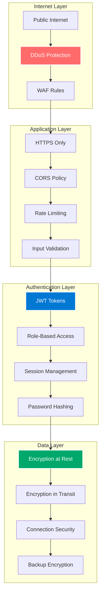
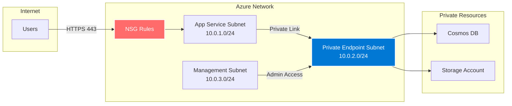
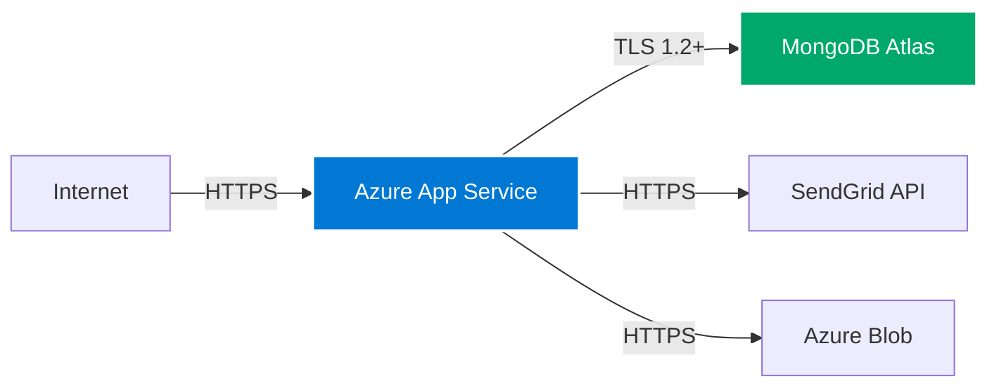
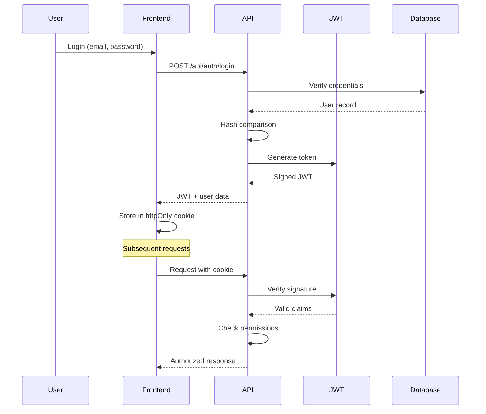
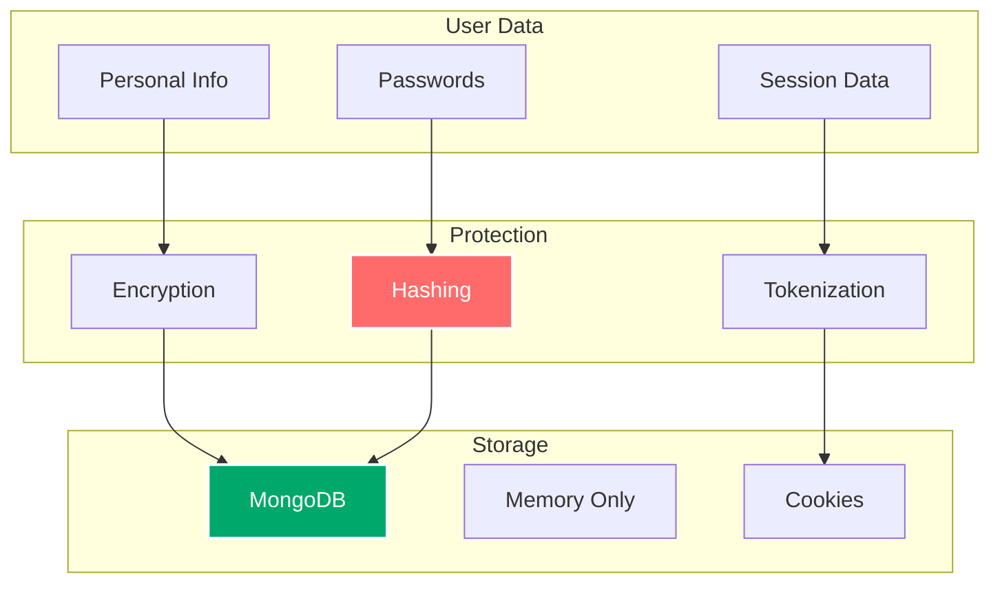

# :material-shield-lock: Security & Network

## Overview

KulturHub implements a comprehensive security strategy based on Zero Trust principles, defense in depth, and least privilege access. This document covers network isolation, authentication, data protection, and security best practices.

## Security Architecture



## Network Security

### Original Azure VNet Architecture

The initial implementation used comprehensive network isolation:



### Network Security Groups (NSG)

Inbound rules configuration:

| Priority | Name | Port | Protocol | Source | Destination | Action |
|----------|------|------|----------|---------|-------------|--------|
| 100 | AllowHTTPS | 443 | TCP | Internet | Any | Allow |
| 200 | AllowHealthProbe | Any | Any | AzureLoadBalancer | Any | Allow |
| 300 | DenyAllInbound | Any | Any | Any | Any | Deny |

Outbound rules:

| Priority | Name | Port | Protocol | Source | Destination | Action |
|----------|------|------|----------|---------|-------------|--------|
| 100 | AllowAzureServices | Any | Any | Any | AzureCloud | Allow |
| 200 | AllowInternet | Any | Any | Any | Internet | Allow |

### Current Network Security

Post-optimization, security focuses on application-level controls:



Key security measures:<br>
- **IP Whitelisting** on MongoDB Atlas<br>
- **HTTPS everywhere** with TLS 1.2 minimum<br>
- **App Service** built-in DDoS protection<br>
- **CORS** configured for specific origins

## Authentication & Authorization

### JWT Implementation



### Role-Based Access Control (RBAC)

User roles and permissions:

| Role | Permissions | Access Level |
|------|------------|--------------|
| **User** | View events, RSVP, update profile | Basic |
| **Organizer** | Create/edit own events, view RSVPs | Extended |
| **Admin** | All permissions, user management | Full |

Implementation:

```typescript
// Middleware for route protection
export async function requireAuth(
  request: Request,
  requiredRole?: string
) {
  const token = request.cookies.get('token');
  
  if (!token) {
    throw new Error('Unauthorized');
  }
  
  const payload = await verifyJWT(token);
  
  if (requiredRole && payload.role !== requiredRole) {
    throw new Error('Insufficient permissions');
  }
  
  return payload;
}
```

### Password Security

Password handling best practices:

1. **Hashing Algorithm:** bcrypt with 10 rounds
2. **Minimum Requirements:**
   - 8 characters minimum
   - Mix of letters and numbers
   - No common passwords

3. **Storage:** Only hashed passwords in database
4. **Reset Flow:** Secure token-based reset

## Data Security

### Encryption

#### At Rest
- **MongoDB Atlas:** Encrypted storage volumes
- **Azure Blob:** Storage Service Encryption (SSE)
- **Backups:** Encrypted with Azure-managed keys

#### In Transit
- **All APIs:** TLS 1.2+ required
- **Database:** MongoDB wire protocol over TLS
- **Internal:** HTTPS between all services

### Data Protection Measures



## Application Security

### Input Validation

All user inputs are validated:

```typescript
// Zod schema example
const eventSchema = z.object({
  title: z.string().min(3).max(100),
  description: z.string().min(10).max(1000),
  date: z.date().min(new Date()),
  location: z.string().min(3).max(200),
  capacity: z.number().int().positive().max(10000),
  category: z.enum(['music', 'art', 'tech', 'food', 'sports'])
});
```

### Security Headers

Application security headers:

```typescript
// Security headers middleware
export const securityHeaders = {
  'X-Frame-Options': 'DENY',
  'X-Content-Type-Options': 'nosniff',
  'X-XSS-Protection': '1; mode=block',
  'Referrer-Policy': 'strict-origin-when-cross-origin',
  'Permissions-Policy': 'camera=(), microphone=(), geolocation=()',
  'Content-Security-Policy': "default-src 'self'; script-src 'self' 'unsafe-inline' 'unsafe-eval'; style-src 'self' 'unsafe-inline';"
};
```

### CORS Configuration

```typescript
// CORS settings
const corsOptions = {
  origin: process.env.NODE_ENV === 'production' 
    ? ['https://kulturhub-app-prod.azurewebsites.net']
    : ['http://localhost:3000'],
  credentials: true,
  methods: ['GET', 'POST', 'PUT', 'DELETE', 'OPTIONS'],
  allowedHeaders: ['Content-Type', 'Authorization']
};
```

## Secrets Management

### Development Environment

Local development uses `.env.local`:

```bash
# .env.local (git ignored)
MONGODB_URI=mongodb+srv://...
JWT_SECRET=random-secure-string
SENDGRID_API_KEY=SG...
AZURE_STORAGE_CONNECTION_STRING=...
```

### Production Environment

Production secrets stored in:

1. **GitHub Secrets** - For CI/CD pipeline
2. **App Service Configuration** - Runtime variables
3. **Connection Strings** - Secure database connections

### Secret Rotation

Regular rotation schedule:

| Secret Type | Rotation Frequency | Method |
|-------------|-------------------|---------|
| JWT Secret | Every 90 days | Manual update |
| API Keys | Every 180 days | Provider rotation |
| Database Password | Every 365 days | Atlas rotation |

## Security Monitoring

### Threat Detection

Monitoring for security events:

1. **Failed Login Attempts**
   - Track by IP and email
   - Temporary lockout after 5 failures
   - Alert on patterns

2. **Suspicious Activities**
   - Multiple role change requests
   - Bulk data access
   - Unusual API patterns

3. **Error Monitoring**
   - 401/403 response tracking
   - Input validation failures
   - CORS violations

### Audit Logging

Key events logged:

```typescript
// Audit log structure
interface AuditLog {
  timestamp: Date;
  userId: string;
  action: string;
  resource: string;
  ipAddress: string;
  userAgent: string;
  result: 'success' | 'failure';
  metadata?: Record<string, any>;
}
```

## Incident Response

### Response Plan

1. **Detection** - Automated alerts
2. **Assessment** - Severity determination
3. **Containment** - Isolate affected systems
4. **Eradication** - Remove threat
5. **Recovery** - Restore services
6. **Lessons Learned** - Update procedures

### Emergency Procedures

Quick actions for common scenarios:

```bash
# Disable compromised user
db.users.updateOne(
  { email: "compromised@email.com" },
  { $set: { disabled: true } }
)

# Rotate JWT secret
az webapp config appsettings set \
  --name kulturhub-app-prod \
  --resource-group kulturhub-rg-prod \
  --settings JWT_SECRET="new-secret"

# Block IP in NSG
az network nsg rule create \
  --resource-group kulturhub-rg-prod \
  --nsg-name kulturhub-nsg \
  --name BlockSuspiciousIP \
  --priority 150 \
  --source-address-prefixes "malicious-ip" \
  --access Deny
```

## Compliance & Best Practices

### GDPR Compliance

- **Data Minimization** - Only collect necessary data
- **User Consent** - Clear privacy policy
- **Right to Delete** - User data deletion API
- **Data Portability** - Export user data feature

### Security Checklist

- [ ] HTTPS enforced on all endpoints
- [ ] Input validation on all forms
- [ ] SQL injection prevention (NoSQL parameterization)
- [ ] XSS protection headers
- [ ] CSRF tokens for state-changing operations
- [ ] Rate limiting on authentication endpoints
- [ ] Secure session management
- [ ] Regular dependency updates
- [ ] Security scanning in CI/CD
- [ ] Incident response plan documented

---

<div class="text-center" markdown>

[:material-arrow-left: CI/CD Pipeline](cicd.md){ .md-button }
[:material-arrow-right: Monitoring](monitoring.md){ .md-button .md-button--primary }

</div>