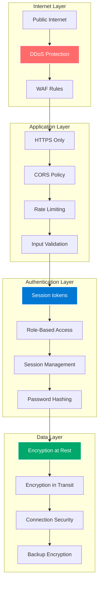
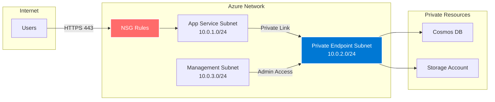
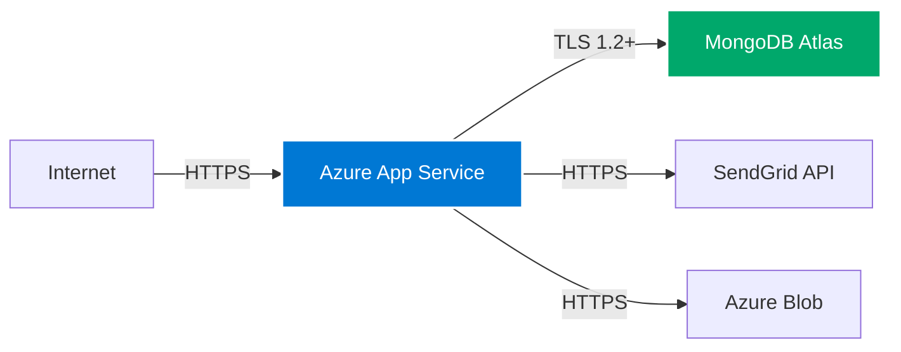
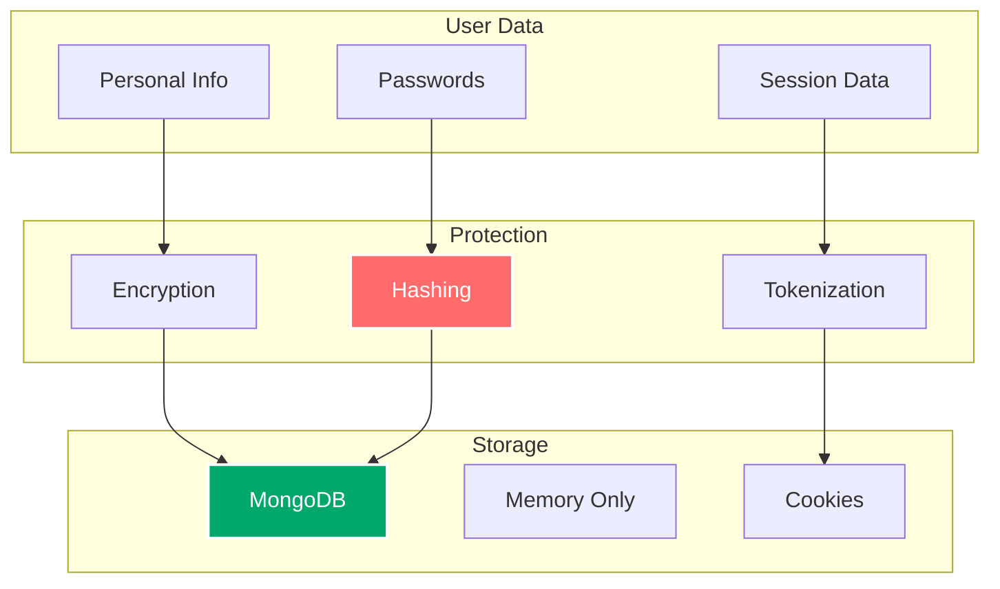

!!! info "Architecture and evidence"
    This page preserves the original VNet/NSG design alongside the simpler App Service + Atlas layout. The session section describes the proposed code update; the other code blocks are examples unless linked to application source. I do not claim a GDPR certification or an independent security grade.

# :material-shield-lock: Security & Network

## Overview

I describe security controls I implemented in the application and the network design I explored on Azure. The architecture diagram below is a layered checklist: WAF, rate limiting and backup verification are optional or pending unless linked to a deployed configuration.

## Security Architecture


```mermaid
graph TB
    subgraph "Internet Layer"
        A[Public Internet]
        B[DDoS Protection]
        C[WAF Rules]
    end
    
    subgraph "Application Layer"
        D[HTTPS Only]
        E[CORS Policy]
        F[Rate Limiting]
        G[Input Validation]
    end
    
    subgraph "Authentication Layer"
        H[Session tokens]
        I[Role-Based Access]
        J[Session Management]
        K[Password Hashing]
    end
    
    subgraph "Data Layer"
        L[Encryption at Rest]
        M[Encryption in Transit]
        N[Connection Security]
        O[Backup Encryption]
    end
    
    A --> B
    B --> C
    C --> D
    D --> E
    E --> F
    F --> G
    G --> H
    H --> I
    I --> J
    J --> K
    K --> L
    L --> M
    M --> N
    N --> O
    
    style B fill:#ff6b6b,stroke:#fff,stroke-width:2px,color:#fff
    style H fill:#0078d4,stroke:#fff,stroke-width:2px,color:#fff
    style L fill:#00a86b,stroke:#fff,stroke-width:2px,color:#fff
```

## Network Security

### Original Azure VNet Architecture

The initial implementation used comprehensive network isolation:


```mermaid
graph LR
    subgraph "Internet"
        A[Users]
    end
    
    subgraph "Azure Network"
        B[NSG Rules]
        C[App Service Subnet<br/>10.0.1.0/24]
        D[Private Endpoint Subnet<br/>10.0.2.0/24]
        E[Management Subnet<br/>10.0.3.0/24]
    end
    
    subgraph "Private Resources"
        F[Cosmos DB]
        G[Storage Account]
    end
    
    A -->|HTTPS 443| B
    B --> C
    C -->|Private Link| D
    D --> F
    D --> G
    E -->|Admin Access| D
    
    style B fill:#ff6b6b,stroke:#fff,stroke-width:2px,color:#fff
    style D fill:#0078d4,stroke:#fff,stroke-width:2px,color:#fff
```

### Network Security Groups (NSG)

Inbound rules configuration:

| Priority | Name | Port | Protocol | Source | Destination | Action |
|----------|------|------|----------|---------|-------------|--------|
| 100 | AllowHTTPS | 443 | TCP | Internet | Any | Allow |
| 200 | AllowHealthProbe | Any | Any | AzureLoadBalancer | Any | Allow |
| 300 | DenyAllInbound | Any | Any | Any | Any | Deny |

Outbound rules:

| Priority | Name | Port | Protocol | Source | Destination | Action |
|----------|------|------|----------|---------|-------------|--------|
| 100 | AllowAzureServices | Any | Any | Any | AzureCloud | Allow |
| 200 | AllowInternet | Any | Any | Any | Internet | Allow |

### Current Network Security

Post-optimization, security focuses on application-level controls:


```mermaid
graph LR
    A[Internet] -->|HTTPS| B[Azure App Service]
    B -->|TLS 1.2+| C[MongoDB Atlas]
    B -->|HTTPS| D[SendGrid API]
    B -->|HTTPS| E[Azure Blob]
    
    style B fill:#0078d4,stroke:#fff,stroke-width:2px,color:#fff
    style C fill:#00a86b,stroke:#fff,stroke-width:2px,color:#fff
```

Key security measures:<br>
- **IP Whitelisting** on MongoDB Atlas<br>
- **HTTPS everywhere** with TLS 1.2 minimum<br>
- **App Service** built-in DDoS protection<br>
- **CORS** configured for specific origins

## Authentication & Authorization

### Server-side session and role checks

I chose an opaque session cookie rather than introducing an identity service. Login compares the stored bcrypt hash, creates a random token and stores only its hash and expiration in MongoDB. On every protected request the server reads the cookie, looks up the current user and checks the role or ownership. Logout deletes the session. The browser's user state is only for presentation.

```mermaid
sequenceDiagram
    participant User
    participant API
    participant DB as MongoDB
    User->>API: POST /api/auth
    API->>DB: Verify password; store token hash
    API-->>User: HttpOnly cookie and public user fields
    User->>API: POST /api/events with cookie
    API->>DB: Resolve session and current role
    API-->>User: 201, 401 or 403
```

In the reviewed update, `user` can RSVP, `organizer` can create and edit own events, and `admin` can manage users and approve organizer applications. Registration always assigns `user` server-side. Enforcement belongs in each API route, not merely in a dashboard or a pass-through middleware. See [`lib/session.ts`](https://github.com/mvulcu/kulturhub_6/blob/codex/kulturhub-core-hardening/lib/session.ts), [event routes](https://github.com/mvulcu/kulturhub_6/blob/codex/kulturhub-core-hardening/app/api/events/route.ts) and [admin route](https://github.com/mvulcu/kulturhub_6/blob/codex/kulturhub-core-hardening/app/api/applications/%5Bid%5D/route.ts).

### Password Security

Password handling best practices:

1. **Hashing Algorithm:** bcrypt with 10 rounds
2. **Minimum Requirements:**
   - 8 characters minimum
   - Strength checks and breached-password screening are potential follow-up work

3. **Storage:** Only hashed passwords in database
4. **Reset Flow:** Not implemented in the reviewed code; document and build before claiming account recovery

## Data Security

### Encryption

#### At Rest
- **MongoDB Atlas:** Encrypted storage volumes
- **Azure Blob:** Storage Service Encryption (SSE)
- **Backups:** Encrypted with Azure-managed keys

#### In Transit
- **All APIs:** TLS 1.2+ required
- **Database:** MongoDB wire protocol over TLS
- **Internal:** HTTPS between all services

### Data Protection Measures


```mermaid
graph TB
    subgraph "User Data"
        A[Personal Info]
        B[Passwords]
        C[Session Data]
    end
    
    subgraph "Protection"
        D[Encryption]
        E[Hashing]
        F[Tokenization]
    end
    
    subgraph "Storage"
        G[MongoDB]
        H[Memory Only]
        I[Cookies]
    end
    
    A --> D
    B --> E
    C --> F
    D --> G
    E --> G
    F --> I
    
    style E fill:#ff6b6b,stroke:#fff,stroke-width:2px,color:#fff
    style G fill:#00a86b,stroke:#fff,stroke-width:2px,color:#fff
```

## Application Security

### Input Validation

All user inputs are validated:

```typescript
// Zod schema example
const eventSchema = z.object({
  title: z.string().min(3).max(100),
  description: z.string().min(10).max(1000),
  date: z.date().min(new Date()),
  location: z.string().min(3).max(200),
  capacity: z.number().int().positive().max(10000),
  category: z.enum(['music', 'art', 'tech', 'food', 'sports'])
});
```

### Security Headers

Illustrative security headers to consider during browser testing. These are not proof that the application currently sets them:

```typescript
// Security headers middleware
export const securityHeaders = {
  'X-Frame-Options': 'DENY',
  'X-Content-Type-Options': 'nosniff',
  'X-XSS-Protection': '1; mode=block',
  'Referrer-Policy': 'strict-origin-when-cross-origin',
  'Permissions-Policy': 'camera=(), microphone=(), geolocation=()',
  'Content-Security-Policy': "default-src 'self'; script-src 'self'; style-src 'self' 'unsafe-inline';"
};
```

### CORS Configuration (illustrative)

```typescript
// CORS settings
const corsOptions = {
  origin: process.env.NODE_ENV === 'production' 
    ? ['https://kulturhub-app-prod.azurewebsites.net']
    : ['http://localhost:3000'],
  credentials: true,
  methods: ['GET', 'POST', 'PUT', 'DELETE', 'OPTIONS'],
  allowedHeaders: ['Content-Type', 'Authorization']
};
```

## Secrets Management

### Development Environment

Local development uses `.env.local`:

```bash
# .env.local (git ignored)
MONGODB_URI=mongodb+srv://...
SENDGRID_API_KEY=SG...
AZURE_STORAGE_CONNECTION_STRING=...
```

### Production Environment

Production secrets stored in:

1. **GitHub Secrets** - For CI/CD pipeline
2. **App Service Configuration** - Runtime variables
3. **Connection Strings** - Secure database connections

### Secret Rotation

Regular rotation schedule:

| Secret Type | Rotation Frequency | Method |
|-------------|-------------------|---------|
| API Keys | Every 180 days | Provider rotation |
| Database Password | Every 365 days | Atlas rotation |

## Security Monitoring

### Threat Detection

Monitoring for security events:

1. **Failed Login Attempts**
   - Track by IP and email
   - Temporary lockout after 5 failures
   - Alert on patterns

2. **Suspicious Activities**
   - Multiple role change requests
   - Bulk data access
   - Unusual API patterns

3. **Error Monitoring**
   - 401/403 response tracking
   - Input validation failures
   - CORS violations

### Audit Logging

Key events logged:

```typescript
// Audit log structure
interface AuditLog {
  timestamp: Date;
  userId: string;
  action: string;
  resource: string;
  ipAddress: string;
  userAgent: string;
  result: 'success' | 'failure';
  metadata?: Record<string, any>;
}
```

## Incident Response

### Response Plan

1. **Detection** - Automated alerts
2. **Assessment** - Severity determination
3. **Containment** - Isolate affected systems
4. **Eradication** - Remove threat
5. **Recovery** - Restore services
6. **Lessons Learned** - Update procedures

### Emergency procedures

If I suspect account compromise, I revoke that user's sessions in the MongoDB `sessions` collection and reset credentials through a controlled process. The reviewed code does not implement a `disabled` flag or a password-reset workflow, so toggling a database flag alone is not a valid containment action. For notification-key compromise I rotate the key in the function and App Service settings, then verify the notification path. I use Azure App Service access restrictions if a source IP must be blocked at the application entry point; an NSG attached to a separate VNet does not automatically filter public App Service requests.

A production incident runbook needs a tested restore procedure, contacts and timestamps. These are next operational tasks, not completed exercises.

## Privacy and security checklist

### Data privacy considerations

- **Data Minimization** - Only collect necessary data
- **User Consent** - Clear privacy policy
- **Right to Delete** - User data deletion API
- **Data Portability** - Export user data feature

### Security Checklist

- [ ] HTTPS enforced on all endpoints
- [ ] Input validation on all forms
- [ ] SQL injection prevention (NoSQL parameterization)
- [ ] XSS protection headers
- [ ] CSRF tokens for state-changing operations
- [ ] Rate limiting on authentication endpoints
- [ ] Secure session management
- [ ] Regular dependency updates
- [ ] Security scanning in CI/CD
- [ ] Incident response plan documented

---

<div class="text-center" markdown>

[:material-arrow-left: CI/CD Pipeline](cicd.md){ .md-button }
[:material-arrow-right: Monitoring](monitoring.md){ .md-button .md-button--primary }

</div>