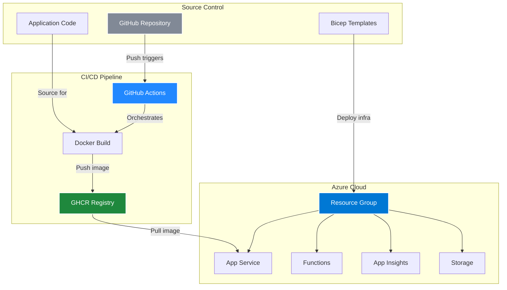
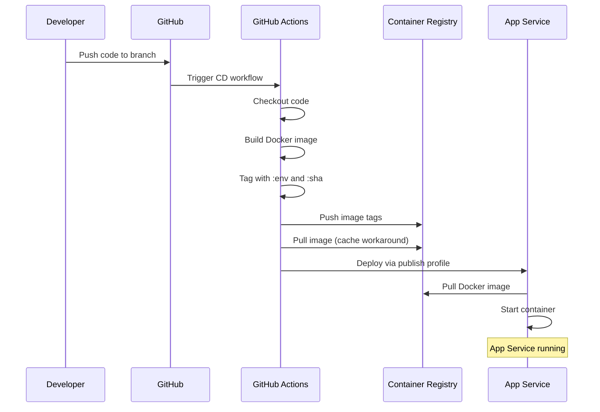

# :material-microsoft-azure: Deploying to Azure

<div class="grid cards" markdown>

-   :material-terraform:{ .lg .middle } __Infrastructure as Code__

    ---

    Define and deploy Azure resources declaratively using Bicep templates for reproducible infrastructure

    [:octicons-package-24: View Architecture](#infrastructure-deployment-bicep){ .md-button }

-   :material-rocket-launch:{ .lg .middle } __Automated CI/CD__

    ---

    GitHub Actions workflows for continuous integration and deployment across dev and prod environments

    [:octicons-workflow-24: Explore Pipelines](#application-deployment-cicd){ .md-button }

</div>

## :material-map-marker-path: Overview

!!! info "Historical Context - Azure Era"
    This documentation represents the original Azure deployment architecture of the DevOps Portfolio project.
    
    **Current Status:** This project has been **migrated to Google Cloud Platform** in October 2024.
    
    [:material-cloud-sync: View Migration Journey](migration.md){ .md-button .md-button--primary }

!!! warning "Azure Student Subscription (Legacy)"
    The original Azure deployment used Azure Student subscription with these limitations:
    
    - ❌ No Key Vault access
    - ❌ No custom RBAC roles
    - ❌ Limited service principal permissions
    - ✅ App Service with publish profiles
    - ✅ Basic Application Insights
    - ✅ Standard storage accounts

!!! abstract "Deployment Architecture"
    The deployment process consists of two main components working together:
    
    - **Infrastructure Provisioning** - Azure Bicep templates define all cloud resources
    - **Application Deployment** - Docker image built and pushed to GHCR by GitHub Actions, then pulled by Azure App Service



## :material-checkbox-marked-circle: Prerequisites

!!! warning "Required Setup"
    Ensure you have all prerequisites configured before proceeding with deployment

<div class="grid" markdown>

:material-microsoft-azure:{ .lg } **Azure Account**
: Azure Student subscription is sufficient

:material-console:{ .lg } **Azure CLI**
: For manual Bicep deployments

:material-github:{ .lg } **GitHub Account**
: Private repository with Actions

:material-package-variant:{ .lg } **Docker Support**
: GitHub Container Registry (GHCR)

</div>

### Required Configurations

=== "Resource Group"
    ```bash
    # Create resource group
    az group create \
      --name portfolio-rg \
      --location westeurope
    ```

=== "Publish Profiles"
    Download from Azure Portal:<br>
    1. Navigate to App Service<br>
    2. Go to Deployment Center<br>
    3. Download Publish Profile<br>
    4. Add to GitHub Secrets

=== "GHCR Access"
    Configure GitHub Container Registry:<br>
    1. Enable package permissions<br>
    2. Set visibility (public/private)<br>
    3. Configure retention policies

## :material-terraform: Infrastructure Deployment (Bicep)

### 📁 Infrastructure Structure

!!! info "Modular Architecture"
    Infrastructure is organized into reusable Bicep modules for maintainability

```
infra/
├── main.bicep                 # Main orchestration file
├── modules/                   # Reusable components
│   ├── appservice-plan.bicep
│   ├── appservice.bicep
│   ├── insights.bicep
│   └── storage.bicep
└── parameters/               # Environment configs
    ├── dev.bicepparam
    └── prod.bicepparam
```

### 🔧 Resource Components

=== "App Service Plan"
    ```yaml
    Purpose: Hosting environment for web apps
    SKU: B1 (Dev) / P1V2 (Prod)
    OS: Linux
    Features: Auto-scaling, Always On
    ```

=== "App Service"
    ```yaml
    Purpose: Hosts containerized Next.js app
    Runtime: Docker
    Configuration: Environment variables, custom domain
    Monitoring: Integrated with App Insights
    ```

=== "Application Insights"
    ```yaml
    Purpose: Application performance monitoring
    Features: Real-time metrics, logs, alerts
    Integration: Both frontend and backend
    Retention: 90 days
    ```

=== "Storage Account"
    ```yaml
    Purpose: Static assets and backups
    Type: Standard LRS
    Access: Private endpoints
    Features: Blob storage, CDN integration
    ```

### 🚀 Deployment Methods

!!! tip "Choose your deployment method based on your workflow"

=== "Automated (GitHub Actions)"

    The `.github/workflows/infra.yml` workflow handles automated deployments:
    
    ```yaml
    Trigger: Manual (workflow_dispatch)
    Authentication: Service Principal
    Target: Production by default
    ```
    
    **Workflow Features:**<br>
    - Parameter validation<br>
    - What-if analysis<br>
    - Deployment output capture<br>
    - Error handling

=== "Manual (Azure CLI)"

    ```bash
    # Login to Azure
    az login
    
    # Set subscription
    az account set --subscription "<YOUR_SUBSCRIPTION_ID>"
    
    # Navigate to infrastructure directory
    cd infra
    
    # Deploy production environment
    az deployment group create \
      --resource-group portfolio-rg \
      --template-file ./main.bicep \
      --parameters ./parameters/prod.bicepparam
    
    # Deploy development environment
    az deployment group create \
      --resource-group portfolio-rg \
      --template-file ./main.bicep \
      --parameters ./parameters/dev.bicepparam
    ```

## :material-docker: Application Deployment (CI/CD)

### 🐳 Containerization Strategy

!!! example "Docker Build and Deployment Flow"
    Docker image is built and pushed to GHCR inside the CD pipeline, orchestrated by GitHub Actions



**Image Details:**<br>
- Base: `node:20-alpine`<br>
- Size: ~150MB (optimized)<br>
- Registry: GitHub Container Registry<br>
- Tags: `dev`, `prod`, `{git-sha}`

### 📦 CI/CD Workflows

<div class="grid cards" markdown>

-   :material-check-circle:{ .lg .middle } __Continuous Integration__

    ---

    **Workflow:** `ci.yml`
    
    **Triggers:**<br>
    - Push to `main` or `dev`<br>
    - Pull requests
    
    **Steps:**<br>
    - Install dependencies (pnpm)<br>
    - Run linting<br>
    - Execute unit tests<br>
    - Audit dependencies<br>
    - Build verification

-   :material-rocket:{ .lg .middle } __Development Deployment__

    ---

    **Workflow:** `cd-dev.yml`
    
    **Trigger:** <br>
    Push to `dev` branch
    
    **Process:**<br>
    1. Build Docker image<br>
    2. Tag as `:dev` and `:sha`<br>
    3. Push to GHCR<br>
    4. Pull image (cache workaround)<br>
    5. Deploy via publish profile

-   :material-shield-check:{ .lg .middle } __Production Deployment__

    ---

    **Workflow:** `cd-prod.yml`
    
    **Trigger:** <br>
    Push to `main` branch
    
    **Process:**<br>
    1. Build Docker image<br>
    2. Tag as `:prod` and `:sha`<br>
    3. Push to GHCR<br>
    4. Pull image (cache workaround)<br>
    5. Deploy via publish profile<br>

</div>

!!! example "CD Workflow Example"
    ```yaml
    # Key sections from CD workflow
    env:
      GHCR_IMAGE: ghcr.io/mvulcu/devops-portfolio
    
    steps:
      # Docker build with multiple tags
      - Build image with :dev and :sha tags
      
      # Push to GitHub Container Registry
      - Push both tags to GHCR
      
      # Azure deployment workaround
      - Pull image before deploy (cache fix)
      
      # Deploy using publish profile
      - Deploy to Azure App Service
    ```

### 🔐 Environment Configuration

=== "Development Environment"

    ```yaml
    Branch: dev
    URL: https://portfolio-app-dev-*.azurewebsites.net
    Features:
      - Debug logging enabled
      - Performance profiling
      - Test integrations
    Resources:
      - Suffix: -dev
      - Lower SKUs for cost optimization
    ```

=== "Production Environment"

    ```yaml
    Branch: main
    URL: https://portfolio-app-prod-*.azurewebsites.net
    Features:
      - Optimized builds
      - Caching enabled
      - Security headers
    Resources:
      - Suffix: -prod
      - Auto-scaling enabled
    ```

## :material-key-variant: Secrets Management

!!! danger "Security on Azure Student"
    Azure Student subscription has limitations - Key Vault and RBAC are not available. All secrets are managed through GitHub Secrets and App Service settings.

### GitHub Secrets Configuration

| Secret Name | Purpose | Format |
|------------|---------|--------|
| `AZURE_DEV_PUBLISH_PROFILE` | Dev App Service deployment | XML |
| `AZURE_PROD_PUBLISH_PROFILE` | Prod App Service deployment | XML |
| `GITHUB_TOKEN` | GHCR authentication | Auto-provided |

### Application Settings


!!! info "Azure Student Limitations"
    - No Key Vault access
    - No custom RBAC roles
    - Limited to App Service authentication
    - Secrets stored as App Service settings

## :material-monitor-dashboard: Monitoring Function

!!! info "Health Check Service"
    Separate Azure Function provides real-time health metrics for the portfolio

**Deployment Details:**<br>
- **Type:** Azure Function App (Node.js)<br>
- **Endpoint:** `/api/healthcheck`<br>
- **Metrics:** Uptime, latency, memory usage<br>
- **Update Frequency:** Every 30 seconds<br>

**Access:**
```
https://portfolio-function-monitoring.azurewebsites.net/api/healthcheck
```

## :material-checkbox-multiple-marked: Verification Steps

### Post-Deployment Checklist

- [ ] **GitHub Actions** - All workflows completed successfully
- [ ] **Azure Portal** - Resources visible in correct resource group
- [ ] **App Service** - Application running without errors
- [ ] **Custom Domain** - DNS configured (if applicable)
- [ ] **SSL Certificate** - HTTPS working correctly
- [ ] **Application Insights** - Telemetry data flowing
- [ ] **Health Check** - Monitoring endpoint responding
- [ ] **Performance** - Page load times acceptable

### Troubleshooting Guide

??? warning "Common Issues"

    **Docker Image Not Found**
    : Ensure GHCR permissions are correctly configured
    
    **Deployment Timeout**
    : Check App Service logs for startup errors
    
    **Bicep Validation Errors**
    : Verify parameter files match template requirements
    
    **Authentication Failures**
    : Regenerate service principal credentials

## :material-chart-timeline: Performance Optimization

!!! success "Deployment Best Practices"
    - Use deployment slots for zero-downtime deployments
    - Enable Application Insights profiling
    - Configure auto-scaling rules
    - Implement health checks
    - Use Azure CDN for static assets

---

<div class="text-center" markdown>

**Part of the DevOps Portfolio project by Maria Vulcu**

[:material-arrow-left: Back to Portfolio](index.md){ .md-button }
[:material-cloud-sync: Migration Journey](migration.md){ .md-button .md-button--primary }
[:material-monitor-dashboard: Monitoring Strategy](monitoring.md){ .md-button }

</div>