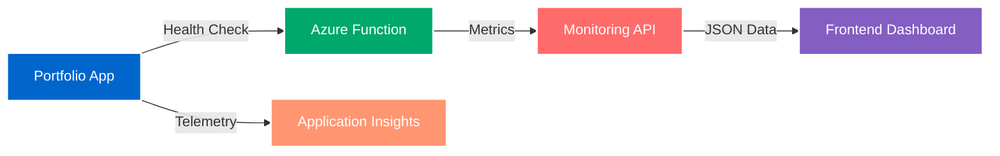
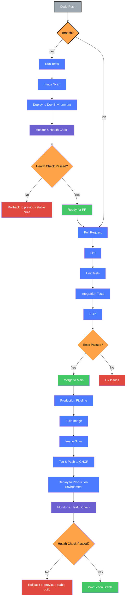

# Maria Vulcu | DevOps Engineer Portfolio { .text-center }

<div class="grid cards" markdown>

-   :material-cloud-outline:{ .lg .middle } __Cloud Native Application__

    ---

    Not just a portfolio – a fully-fledged cloud application with real-time monitoring, automated deployments, and infrastructure as code

    [:octicons-arrow-right-24: View Live Demo](https://portfolio-app-prod-4f3dfbvo.azurewebsites.net){ .md-button }

-   :material-chart-line:{ .lg .middle } __Live Monitoring Dashboard__

    ---

    Real-time metrics visualization showcasing uptime, latency, and resource usage with beautiful charts
    <br>
    <br>
    
    [:octicons-graph-24: Check Health Status](https://portfolio-function-monitoring.azurewebsites.net/api/healthcheck){ .md-button .md-button--primary }

</div>

## :material-lightning-bolt: Quick Overview

!!! example "Live Production Environment"
    
    🚀 **Production URL:** [portfolio-app-prod-4f3dfbvo.azurewebsites.net](https://portfolio-app-prod-4f3dfbvo.azurewebsites.net)
    
    📊 **Monitoring API:** [Health Check Endpoint](https://portfolio-function-monitoring.azurewebsites.net/api/healthcheck)
       
## :material-stack-overflow: Tech Stack

=== "Frontend"

    ```yaml
    Framework: Next.js 14
    Language: TypeScript
    Styling: Tailwind CSS
    Animations: Framer Motion
    Charts: Recharts
    ```

=== "Backend & Cloud"

    ```yaml
    API: Next.js API Routes
    Functions: Azure Functions (Node.js)
    Platform: Microsoft Azure
    Container: Docker
    ```

=== "DevOps"

    ```yaml
    CI/CD: GitHub Actions
    IaC: Azure Bicep
    Monitoring: Application Insights
    Analytics: Custom Azure Functions
    ```

## :material-star-shooting: Key Features

<div class="annotate" markdown>

- :material-monitor-dashboard: **Live Monitoring Dashboard** (1)
- :material-github: **Automated CI/CD Pipelines** (2)
- :material-terraform: **Infrastructure as Code** (3)
- :material-docker: **Containerized Application** (4)
- :material-theme-light-dark: **Light/Dark Mode**
- :material-shield-check: **GDPR Compliant**
- :material-responsive: **Fully Responsive**
- :material-google-analytics: **Analytics Integration**

</div>

1. Real-time display of application health metrics including uptime, latency, and memory usage
2. Automated build, test, and deployment workflows for both application and infrastructure
3. Azure resources managed declaratively using Bicep templates
4. Next.js app containerized with Docker and deployed to Azure App Service

## :material-rocket: Getting Started

### Prerequisites

!!! info "Required Tools"
    - [x] Node.js v20+
    - [x] pnpm package manager
    - [x] Docker (for containerization)
    - [x] Azure CLI (for deployment)

### :material-laptop: Local Development

=== "Clone & Install"

    ```bash
    # Clone the repository
    git clone https://github.com/mvulcu/devops-portfolio.git
    cd devops-portfolio

    # Install dependencies
    pnpm install
    ```

=== "Development Server"

    ```bash
    # Start development server
    pnpm dev

    # Application available at http://localhost:3000
    ```

=== "Production Build"

    ```bash
    # Build for production
    pnpm build

    # Start production server
    pnpm start
    ```

### :material-cloud-upload: Deploy to Azure

!!! tip "Infrastructure as Code Deployment"
    All Azure resources are defined in Bicep templates for reproducible deployments

=== "Production Environment"

    ```bash
    cd infra
    
    az deployment group create \
      --resource-group your-resource-group-name \
      --template-file ./main.bicep \
      --parameters ./parameters/prod.bicepparam
    ```

=== "Development Environment"

    ```bash
    cd infra
    
    az deployment group create \
      --resource-group your-resource-group-name \
      --template-file ./main.bicep \
      --parameters ./parameters/dev.bicepparam
    ```

## :material-chart-line: Monitoring Architecture



### Metrics Collected

<div class="grid" markdown>

:material-clock-check:{ .lg } **Uptime**
: Application availability percentage

:material-speedometer:{ .lg } **Latency**
: API response time in milliseconds

:material-memory:{ .lg } **Memory**
: Heap usage and percentage

:material-chart-timeline:{ .lg } **Trends**
: Historical performance data

</div>

## :material-pipe: CI/CD Pipeline



<div class="text-center" markdown>

**Built with** :material-heart: **by Maria Vulcu**

[:material-github: GitHub](https://github.com/mvulcu){ .md-button .md-button--primary }
[:material-linkedin: LinkedIn](https://www.linkedin.com/in/mariavulcu){ .md-button }
[:material-email: Contact](#){ .md-button }

</div>