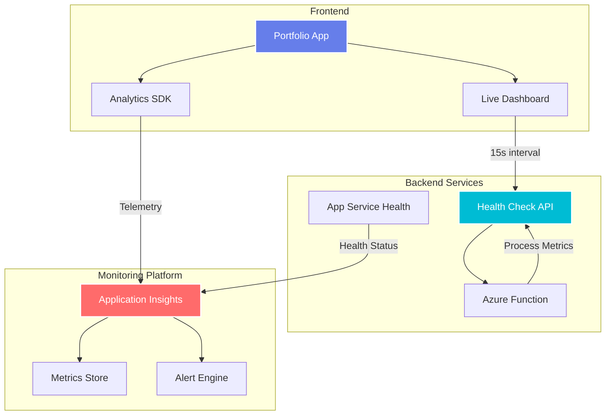
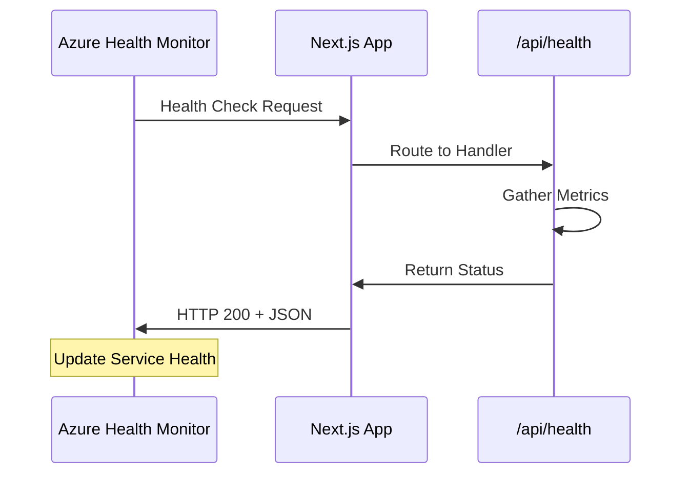
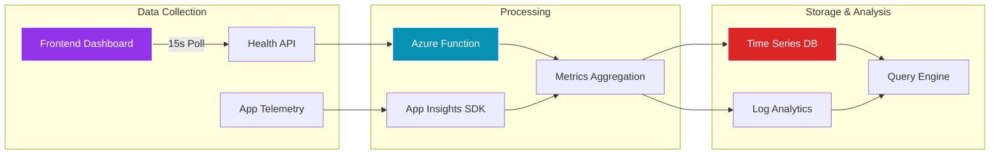
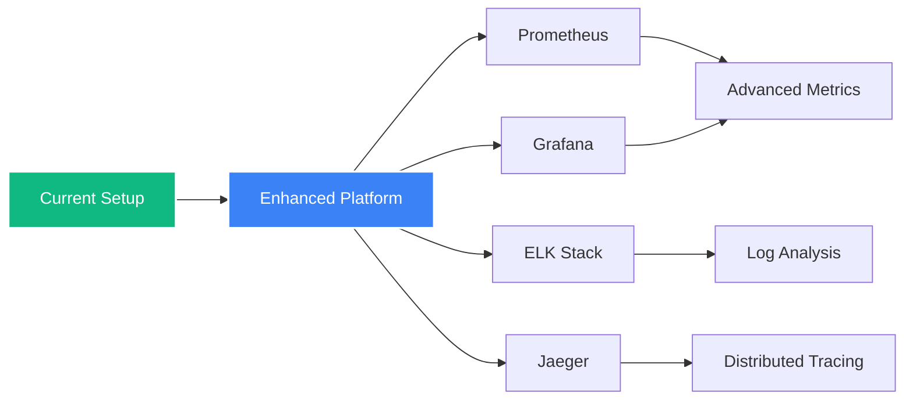

# :material-chart-areaspline: Monitoring Strategy for DevOps Portfolio

<div class="grid cards" markdown>

-   :material-chart-line:{ .lg .middle } __Real-time Dashboard__

    ---

    Live metrics visualization directly on the portfolio's main page showing health, performance, and usage data

    [:octicons-graph-24: View Components](#frontend-live-dashboard){ .md-button }

-   :material-function-variant:{ .lg .middle } __Health Check API__

    ---

    Custom Azure Function providing centralized metrics endpoint with system health indicators

    [:octicons-pulse-24: Explore API](#health-check-api-evolution){ .md-button }

</div>

## :material-map: Overview

!!! info "Platform Evolution - Azure to GCP Migration"
    This monitoring documentation covers both the original Azure-based monitoring setup and the current GCP implementation.
    
    **Migration Status:** The project was successfully migrated from Azure to GCP in October 2024.
    
    [:material-cloud-sync: View Full Migration Journey](migration.md){ .md-button .md-button--primary }

!!! abstract "Monitoring Architecture Evolution"
    The monitoring strategy demonstrates practical cloud monitoring across both platforms:
    
    - **Real-time Health Status** - Visible health metrics on the main page
    - **Performance Metrics** - Track latency, memory, and resource usage  
    - **Platform Migration** - Azure Functions → GCP Cloud Run monitoring
    - **Usage Analytics** - User interactions with privacy-first approach



## :material-view-dashboard: Components

### Frontend Live Dashboard

!!! info "Real-time Metrics Visualization"
    Integrated monitoring component displaying live system health directly on the portfolio

**Technical Details:**

=== "Implementation"
    ```yaml
    Location: /components/monitoring.tsx
    Library: Recharts for data visualization
    Update: Every 15 seconds via API polling
    State: React hooks for data management
    ```

=== "Visualizations"
    - **Uptime Gauge** - Service availability percentage
    - **Latency Meter** - Response time in milliseconds
    - **Memory Chart** - Heap usage with percentage
    - **Trend Graphs** - Historical data (last 30 points)

=== "Features"
    - Auto-refresh with loading states
    - Error handling and retry logic
    - Responsive design for all devices
    - Smooth animations and transitions

### Health Check API Evolution

=== "Current: GCP Cloud Run"

    !!! success "Cloud Run Health Metrics"
        
        **Platform:** Google Cloud Run (current)
        **Technology:** Node.js containerized service
        **Benefits:** Better cold starts, serverless scaling

=== "Legacy: Azure Functions"

    !!! example "Azure Function Health Check API (Legacy)"
        
        **Endpoint:** `https://portfolio-function-monitoring.azurewebsites.net/api/healthcheck`
        **Technology:** Node.js Azure Function
        **Status:** Migrated to GCP in October 2024

<div class="grid" markdown>

:material-api:{ .lg } **API Response**
: JSON formatted health metrics

:material-timer-sand:{ .lg } **Response Time**
: < 100ms average latency

:material-shield-check:{ .lg } **Availability**
: 99.9% uptime SLA

:material-refresh:{ .lg } **Update Rate**
: Real-time on request

</div>

#### Metrics Exposed

| Metric | Type | Description |
|--------|------|-------------|
| `status` | String | Service health: "ok" or "error" |
| `uptime` | Number | Process uptime in seconds |
| `latency` | Number | Simulated response time (0-100ms) |
| `memory` | Object | Heap usage statistics |
| `cpu` | Object | CPU usage (user/system) |
| `usersOnline` | Number | Active users (demo value) |
| `errors` | Number | Error count (currently 0) |
| `timestamp` | String | ISO timestamp |
| `hostname` | String | Function instance ID |
| `environment` | String | Runtime environment |

### Next.js Application Health Endpoint

!!! tip "Native Health Check Integration"
    Built-in endpoint for Azure App Service health monitoring



**Endpoint Details:**<br>
- **Path:** `/api/health`<br>
- **Method:** GET<br>
- **Response:** JSON with process metrics<br>
- **Purpose:** Azure's built-in health checks

### Monitoring Platform Evolution

=== "Current: GCP Cloud Monitoring"

    !!! success "Google Cloud Monitoring & Logging"
        Built-in observability with Cloud Run integration
        
        **Features:**
        - Container metrics and logs
        - Real-time monitoring
        - Distributed tracing support
        - Cost-effective pricing

=== "Legacy: Azure Application Insights"

    !!! info "Azure Application Insights (Legacy)"
        Full-stack monitoring from client interactions to server performance
        
        **Status:** Replaced with GCP Cloud Monitoring during migration

<div class="grid cards" markdown>

-   :material-monitor:{ .lg .middle } __APM Features__

    ---
    
    - Server response times
    - Request rates & failures
    - Dependency tracking
    - Exception logging

-   :material-web:{ .lg .middle } __Frontend Analytics__

    ---
    
    - Page view tracking
    - User sessions
    - Browser metrics
    - Custom events

-   :material-shield-alert:{ .lg .middle } __Privacy Controls__

    ---
    
    - Cookie consent integration
    - Anonymized user data
    - GDPR compliance
    - Opt-out mechanisms

</div>

## :material-chart-areaspline: Metrics Collected

### System Metrics

=== "Performance"
    ```yaml
    Uptime:
      - Process runtime
      - Service availability
      - Restart frequency
    
    Latency:
      - API response times
      - Page load duration
      - Database queries
    
    Throughput:
      - Requests per second
      - Concurrent users
      - Data transfer rates
    ```

=== "Resources"
    ```yaml
    Memory:
      - Heap usage
      - Total allocated
      - Garbage collection
    
    CPU:
      - User time
      - System time
      - Load average
    
    Storage:
      - Disk usage
      - I/O operations
      - Cache hits
    ```

=== "Application"
    ```yaml
    Errors:
      - Exception count
      - Error rates
      - Stack traces
    
    Business:
      - Page views
      - User sessions
      - Feature usage
    
    Custom:
      - Cookie consent
      - Navigation patterns
      - API calls
    ```

## :material-pipe-disconnected: Data Flow

!!! abstract "End-to-End Monitoring Pipeline"



### Data Flow Steps

1. **Frontend Dashboard** polls Health Check API every 15 seconds
2. **Azure Function** gathers process metrics and returns JSON
3. **Application** sends telemetry to Application Insights
4. **Insights Platform** processes and stores metrics
5. **Analytics Engine** enables queries and visualizations

## :material-bell-alert: Alerting Strategy

!!! warning "Production Alert Configuration"
    While not fully automated in this demo, production systems should implement:

### Alert Types

<div class="grid" markdown>

:material-alert-circle:{ .lg } **Performance Alerts**
: High latency, slow queries, memory pressure

:material-server-network-off:{ .lg } **Availability Alerts**
: Service down, health check failures, timeouts

:material-bug:{ .lg } **Error Alerts**
: Exception spikes, 5xx errors, critical logs

:material-trending-up:{ .lg } **Capacity Alerts**
: Resource limits, scaling triggers, quotas

</div>

### Alert Channels

=== "Email Notifications"
    - Immediate alerts for critical issues
    - Daily/weekly summary reports
    - Stakeholder distribution lists

=== "Teams/Slack Integration"
    - Real-time notifications in channels
    - Interactive alert management
    - Incident collaboration

=== "PagerDuty/On-Call"
    - 24/7 critical alerts
    - Escalation policies
    - Incident tracking

## :material-rocket-launch: Future Enhancements

!!! info "Roadmap for Advanced Monitoring"

### Planned Improvements

- [ ] **Distributed Tracing** - End-to-end request tracking across services
- [ ] **Advanced Health Checks** - Database connectivity, dependency validation
- [ ] **Time-Series Database** - Prometheus/InfluxDB for long-term storage
- [ ] **Grafana Dashboards** - Custom visualization and alerting
- [ ] **SLO/SLI Tracking** - Service level objectives and indicators
- [ ] **Chaos Engineering** - Resilience testing and monitoring
- [ ] **ML Anomaly Detection** - Predictive alerting and trend analysis

### Integration Opportunities



## :material-shield-check: Best Practices Applied

!!! success "Monitoring Implementation Guidelines"

- ✅ **Privacy First** - Cookie consent and data anonymization
- ✅ **Performance Impact** - Minimal overhead on application
- ✅ **Error Handling** - Graceful degradation if monitoring fails
- ✅ **Cost Optimization** - Efficient data retention policies
- ✅ **Security** - No sensitive data in metrics
- ✅ **Accessibility** - Dashboard works with screen readers
- ✅ **Documentation** - Clear metric definitions

---

<div class="text-center" markdown>

**Part of the DevOps Portfolio project by Maria Vulcu**

[:material-arrow-left: Azure Deployment (Legacy)](deployment.md){ .md-button }
[:material-cloud-sync: Migration Journey](migration.md){ .md-button .md-button--primary }
[:material-arrow-up: Back to Home](index.md){ .md-button }

</div>